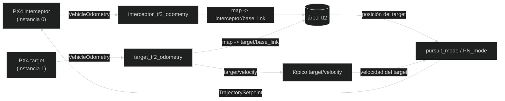
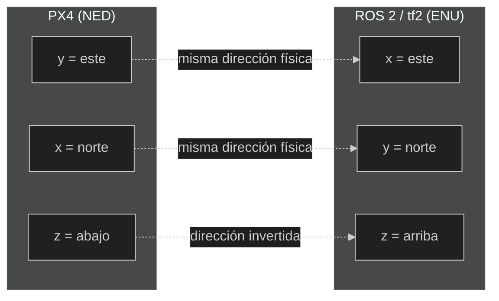

# Arquitectura y flujo de datos

En esta página, **arquitectura** significa la organización del sistema:
qué programas existen, qué dato produce cada uno y quién lo utiliza después.
Un **flujo de datos** es el recorrido de un dato desde su origen hasta quien lo
necesita.

## Visión general

Cada caja es un programa o un dato publicado; cada flecha es "esto produce
aquello, que otro programa consume después". Las flechas no significan
llamadas directas entre funciones. Representan publicación y consumo de
datos: un proceso publica un mensaje, DDS lo entrega y otro proceso ejecuta
su callback. tf2 funciona como un almacén distribuido de relaciones entre
frames.

Un **proceso** es un programa que está ejecutándose. “Publicar” significa
enviar un dato con un nombre; “consumir” significa recibirlo para usarlo.

## Qué ocurre en un ciclo de datos

Imaginemos que el target se mueve unos centímetros:

1. PX4 actualiza su estimación y publica un `VehicleOdometry`.
2. `target_tf2_odometry` recibe el mensaje en una callback.
3. Convierte posición, velocidad y orientación de NED a ENU.
4. Publica una nueva relación `map -> target/base_link`.
5. Guarda la última velocidad y el timer publica `target/velocity`.
6. `pursuit_mode` o `PN_mode` consulta la última posición mediante tf2.
7. El modo combina esa posición con la odometría propia.
8. PX4 recibe el setpoint y su controlador intenta seguirlo.

El ciclo se repite continuamente. No existe una única función `followTarget()`;
el comportamiento emerge de varios callbacks, timers y controladores.

## Dos instancias PX4

| Vehículo | Instancia | Odometría usada por el código |
| --- | ---: | --- |
| Interceptor | `0` | `/fmu/out/vehicle_odometry` |
| Target | `1` | `/px4_1/fmu/out/vehicle_odometry` |

La instancia del target es importante: si se cambia el índice de PX4, también
habría que adaptar el tópico en `target_tf2_odometry.cpp`.

## Marcos de referencia

PX4 trabaja con coordenadas **NED**:

- `x`: norte.
- `y`: este.
- `z`: abajo.

ROS 2 y tf2 trabajan aquí con **ENU**:

- `x`: este.
- `y`: norte.
- `z`: arriba.

Ningún eje conserva su letra: el `x` de NED es norte, pero el `x` de ENU es
este. Solo `z` conserva la misma letra en ambos sistemas y, aun así, apunta en
direcciones opuestas. Esta es la razón por la que una conversión de frame no es
opcional ni cosmética.

Los nodos `*_tf2_odometry` usan `px4_ros_com::frame_transforms` para convertir
posición, velocidad y orientación. Después publican:

- `map -> interceptor/base_link`
- `map -> target/base_link`

Los modos consultan la posición del target en ENU mediante tf2 y la convierten de
nuevo a NED para hacer los cálculos que necesita PX4.

### Por qué no se mezclan los frames

Un vector `(1, 0, 0)` no significa lo mismo en todos los frames. Si se usa ENU
como si fuera NED, el interceptor puede intentar moverse hacia el eje equivocado
o invertir la dirección vertical. Por eso cada conversión debe estar cerca del
dato que cambia de sistema y debe quedar documentada.

En tf2, `map -> target/base_link` significa “dónde está el origen del frame del
target expresado en map”; no significa que el target publique directamente una
posición absoluta en todos los tópicos.

## Por qué existe `target/velocity`

Un transform tf2 contiene posición y orientación, pero no la velocidad. Por eso
`target_tf2_odometry` publica un mensaje `geometry_msgs/msg/TwistStamped` cada
100 ms en `target/velocity`.

`pursuit_mode` solo necesita la posición. `PN_mode` necesita además la velocidad
del target para calcular la velocidad relativa y la rotación de la línea de
visión.

`TwistStamped` contiene un `header` y un `twist`. El header indica cuándo y en
qué frame se interpreta el dato; `twist.linear` contiene la velocidad lineal.
En este proyecto no se usa la velocidad angular.

## Flujo de control

1. PX4 publica `VehicleOdometry`.
2. Un conversor transforma NED a ENU y publica un transform tf2.
3. El modo de guiado consulta `map -> target/base_link` cada 50 ms.
4. El modo lee su propia posición y velocidad mediante `px4_ros2`.
5. Calcula una velocidad y, en PN, una aceleración.
6. `TrajectorySetpointType` entrega el setpoint al interceptor.
7. El modo termina con éxito cuando la distancia al target es menor que 1 m.

## Qué pasa si un componente deja de funcionar

| Componente ausente | Síntoma probable |
| --- | --- |
| PX4 interceptor | No hay odometría propia ni control útil. |
| PX4 target | No aparece el frame del target. |
| Agente DDS | ROS 2 no recibe los topics de PX4. |
| `target_tf2_odometry` | Falta `target/base_link` y `target/velocity`. |
| `interceptor_tf2_odometry` | Falta el frame del interceptor para diagnóstico. |
| `target/velocity` | PN no supera su comprobación de armado. |
| Modo PX4 | Hay datos, pero no se generan setpoints de guiado. |

Esta tabla permite diagnosticar de izquierda a derecha: primero transporte,
después transformación y por último control.

---

🏠 [Inicio](Home.md) · ⬅️ Anterior: [Ejecución de la simulación](Simulation.md) · ➡️ Siguiente: [Nodos de odometría y diagnóstico](Nodes-and-topics.md)
