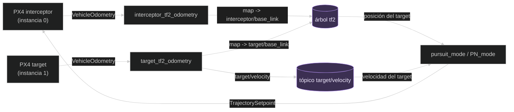
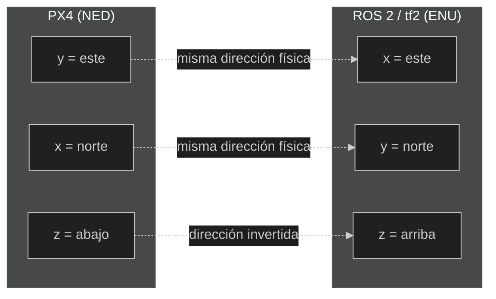

# Arquitectura y flujo de datos

En esta página, **arquitectura** significa la organización del sistema:
qué programas existen, qué dato produce cada uno y quién lo utiliza después.
Un **flujo de datos** es el recorrido de un dato desde su origen hasta quien lo
necesita.

## Visión general

No todas las cajas son lo mismo, y el diagrama lo marca: los rectángulos son
**procesos**, programas en ejecución (las dos instancias de PX4, los dos
conversores tf2, los modos de guiado). Las dos cajas con forma de cilindro y
color distinto —el árbol tf2 y el tópico `target/velocity`— no son
procesos; nadie las "ejecuta". Son sitios donde un proceso deja un dato para
que otro lo recoja más tarde. El árbol tf2 en concreto funciona como un
almacén de relaciones entre frames, mantenido por el sistema tf2, no por el
código propio.

El código no habla con ese almacén directamente: usa tres piezas de la
biblioteca tf2 para hacerlo. El **broadcaster** es lo que usan
`interceptor_tf2_odometry` y `target_tf2_odometry` para *escribir* en el
árbol tf2 (es el "publisher" de tf2). El **buffer** es una copia local de
parte de ese árbol, guardada dentro de cada nodo que necesita consultarlo. El
**listener** es lo que mantiene esa copia local al día: escucha el árbol tf2
en segundo plano y rellena el buffer automáticamente (es el "suscriptor" de
tf2). Los modos de guiado y `tf2_listener` tienen su propio buffer y
listener porque necesitan *leer* el árbol; los conversores tf2 solo tienen
broadcaster porque solo necesitan *escribir* en él.

Las flechas, a su vez, no significan llamadas directas entre funciones:
representan publicación y consumo de datos. Un proceso publica un mensaje,
DDS lo entrega, y otro proceso ejecuta su callback cuando le llega.

Dentro de eso, sus etiquetas no son todas del mismo tipo:

- `VehicleOdometry` y `TrajectorySetpoint` son **tipos de mensaje**, no
  nombres de tópico. El tópico real de la odometría es
  `/fmu/out/vehicle_odometry` (o `/px4_1/...` para el target; ver la tabla
  más abajo).
- `map -> interceptor/base_link` y `map -> target/base_link` no son
  tópicos: son **transforms**, relaciones guardadas dentro del árbol tf2.
- `target/velocity` sí es el **nombre literal de un tópico** ROS 2.
- "posición del target" y "velocidad del target" no son el nombre de nada
  real: son una descripción en español de qué dato se lee en ese punto (una
  consulta al árbol tf2, o el último mensaje recibido en el tópico).

## Dos instancias PX4

| Vehículo | Instancia | Odometría usada por el código |
| --- | ---: | --- |
| Interceptor | `0` | `/fmu/out/vehicle_odometry` |
| Target | `1` | `/px4_1/fmu/out/vehicle_odometry` |

La instancia del target es importante: si se cambia el índice de PX4, también
habría que adaptar el tópico en `target_tf2_odometry.cpp`.

## Qué ocurre en un ciclo de datos

Imaginemos que el target se mueve unos centímetros:

1. PX4 actualiza su estimación y publica un `VehicleOdometry`.
2. `target_tf2_odometry` recibe el mensaje en una callback.
3. Suma a esa posición el desplazamiento entre el origen del target y el del
   interceptor (ver [Qué es `map` aquí](#qué-es-map-aquí-y-por-qué-hay-que-desplazar-al-target)),
   y convierte posición, velocidad y orientación de NED a ENU.
4. Publica una nueva relación `map -> target/base_link`. Si aún falta la
   referencia global de alguno de los dos drones, no publica y avisa.
5. Guarda la última velocidad y el timer publica `target/velocity`.
6. Cada 50 ms, `pursuit_mode` o `PN_mode` consulta esa posición mediante tf2.
7. El modo combina esa posición con su propia odometría (leída vía
   `px4_ros2`) y calcula una velocidad —y, en PN, también una aceleración.
8. `TrajectorySetpointType` entrega ese setpoint a PX4, y su controlador
   intenta seguirlo.
9. Cuando la distancia al target baja de 1 m, el modo se da por completado.

El ciclo (pasos 1-8) se repite continuamente hasta que ocurre el paso 9. No
existe una única función `followTarget()`; el comportamiento emerge de varios
callbacks, timers y controladores.

## Marcos de referencia

PX4 trabaja con coordenadas **NED**:

- `x`: norte.
- `y`: este.
- `z`: abajo.

ROS 2 y tf2 trabajan aquí con **ENU**:

- `x`: este.
- `y`: norte.
- `z`: arriba.

Ningún eje conserva su letra: el `x` de NED es norte, pero el `x` de ENU es
este. Solo `z` conserva la misma letra en ambos sistemas y, aun así, apunta en
direcciones opuestas. Esta es la razón por la que una conversión de frame no es
opcional ni cosmética.

Los nodos `*_tf2_odometry` usan `px4_ros_com::frame_transforms` para convertir
posición, velocidad y orientación. Después publican:

- `map -> interceptor/base_link`
- `map -> target/base_link`

Los modos consultan la posición del target en ENU mediante tf2 y la convierten de
nuevo a NED para hacer los cálculos que necesita PX4.

### Por qué no se mezclan los frames

Un vector `(1, 0, 0)` no significa lo mismo en todos los frames. Si se usa ENU
como si fuera NED, el interceptor puede intentar moverse hacia el eje equivocado
o invertir la dirección vertical. Por eso cada conversión debe estar cerca del
dato que cambia de sistema y debe quedar documentada.

En tf2, `map -> target/base_link` significa “dónde está el origen del frame del
target expresado en map”; no significa que el target publique directamente una
posición absoluta en todos los tópicos.

### Qué es `map` aquí, y por qué hay que desplazar al target

Cada PX4 mide su posición local desde **su propio origen**: el punto donde
arrancó, que su estimador (el EKF) guarda como una coordenada geográfica
(`ref_lat`, `ref_lon`, `ref_alt` del mensaje `VehicleLocalPosition`). Los dos
drones arrancan en sitios distintos, así que cada uno cuenta desde un punto
distinto, aunque ambos digan "estoy en (0, 0)" al empezar.

En este proyecto, `map` es el origen **del interceptor**:
`interceptor_tf2_odometry` publica su posición local tal cual. Si
`target_tf2_odometry` hiciera lo mismo con la del target, estaría mezclando dos
sistemas: con el target arrancado 20 m al norte, tf2 lo situaría igualmente en
(0, 0) y los modos de guiado creerían tenerlo encima nada más empezar.

Por eso `target_tf2_odometry` se suscribe también a `vehicle_local_position` de
las **dos** instancias, calcula el desplazamiento entre los dos orígenes a
partir de sus coordenadas geográficas y se lo suma a la posición del target
antes de publicar el transform. El cálculo se rehace con cada mensaje de
odometría, así que si un EKF reinicia su origen en pleno vuelo, la corrección se
ajusta sola.

Mientras alguna de las dos referencias no sea válida —por ejemplo, justo al
arrancar, antes de que el EKF tenga posición global— el nodo **no publica** el
transform y avisa en el log (como mucho una vez cada 5 segundos). Es preferible
no publicar nada a publicar una posición que mezcla orígenes: sin transform, los
modos de guiado ni siquiera dejan armar.

La velocidad no necesita esa corrección: los ejes NED de los dos orígenes
apuntan en la misma dirección, así que solo cambia la posición.

## Por qué existe `target/velocity`

Un transform tf2 contiene posición y orientación, pero no la velocidad. Por eso
`target_tf2_odometry` publica un mensaje `geometry_msgs/msg/TwistStamped` cada
100 ms en `target/velocity`.

`pursuit_mode` solo necesita la posición. `PN_mode` necesita además la velocidad
del target para calcular la velocidad relativa y la rotación de la línea de
visión.

`TwistStamped` contiene un `header` y un `twist`. El header indica cuándo y en
qué frame se interpreta el dato; `twist.linear` contiene la velocidad lineal.
En este proyecto no se usa la velocidad angular.

## Qué pasa si un componente deja de funcionar

| Componente ausente | Síntoma probable |
| --- | --- |
| PX4 interceptor | No hay odometría propia ni control útil. |
| PX4 target | No aparece el frame del target. |
| Agente DDS | ROS 2 no recibe los tópicos de PX4. |
| `target_tf2_odometry` | Falta `target/base_link` y `target/velocity`. |
| Referencia global de algún dron | No aparece `target/base_link` y el log avisa de que falta la referencia; los modos no dejan armar. |
| `interceptor_tf2_odometry` | Falta el frame del interceptor para diagnóstico. |
| `target/velocity` | PN no supera su comprobación de armado. |
| Modo PX4 | Hay datos, pero no se generan setpoints de guiado. |

Las filas están ordenadas para diagnosticar de arriba a abajo: primero
transporte, después transformación y por último control.

---

🏠 [Inicio](Home.md) · ⬅️ Anterior: [Ejecución de la simulación](Simulation.md) · ➡️ Siguiente: [Nodos de odometría y diagnóstico](Nodes-and-topics.md)
