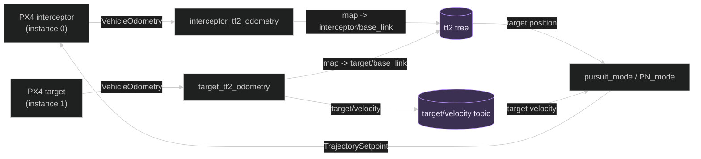
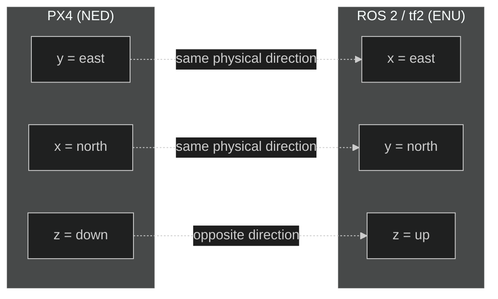

# Architecture and data flow

On this page, **architecture** means how the system is organised: which
programs exist, what data each one produces and who uses it next. A **data
flow** is the path a piece of data follows from where it is produced to
whoever needs it.

## Overview

Not all boxes are the same thing, and the diagram shows it: rectangles are
**processes**, programs that are running (the two PX4 instances, the two tf2
converters, the guidance modes). The two cylinder-shaped boxes in a different
colour (the tf2 tree and the `target/velocity` topic) are not processes;
nobody "runs" them. They are places where one process leaves data for another
to pick up later. The tf2 tree in particular works as a store of relations
between frames, kept by the tf2 system, not by our code.

The code doesn't talk to that store directly: it uses three pieces of the tf2
library. The **broadcaster** is what `interceptor_tf2_odometry` and
`target_tf2_odometry` use to *write* to the tf2 tree (it is tf2's
"publisher"). The **buffer** is a local copy of part of that tree, kept
inside each node that needs to query it. The **listener** keeps that local
copy up to date: it listens to the tf2 tree in the background and fills the
buffer automatically (it is tf2's "subscriber"). The guidance modes and
`tf2_listener` have their own buffer and listener because they need to *read*
the tree; the tf2 converters only have a broadcaster because they only need to
*write* to it.

The arrows, in turn, are not direct function calls: they stand for publishing
and consuming data. One process publishes a message, DDS delivers it, and
another process runs its callback when it arrives.

The arrow labels are not all of the same kind either:

- `VehicleOdometry` and `TrajectorySetpoint` are **message types**, not topic
  names. The actual odometry topic is `/fmu/out/vehicle_odometry` (or
  `/px4_1/...` for the target; see the table below).
- `map -> interceptor/base_link` and `map -> target/base_link` are not topics:
  they are **transforms**, relations stored inside the tf2 tree.
- `target/velocity` is the **literal name of a ROS 2 topic**.
- "target position" and "target velocity" are not the name of anything real:
  they describe which data is read at that point (a query to the tf2 tree, or
  the last message received on the topic).

## Two PX4 instances

| Vehicle | Instance | Odometry used by the code |
| --- | ---: | --- |
| Interceptor | `0` | `/fmu/out/vehicle_odometry` |
| Target | `1` | `/px4_1/fmu/out/vehicle_odometry` |

The target's instance matters: if the PX4 index changes, the topic in
`target_tf2_odometry.cpp` has to change too.

## What happens in one data cycle

Say the target moves a few centimetres:

1. PX4 updates its estimate and publishes a `VehicleOdometry`.
2. `target_tf2_odometry` receives the message in a callback.
3. It adds the offset between the target's origin and the interceptor's (see
   [What `map` is here](#what-map-is-here-and-why-the-target-has-to-be-shifted)),
   and converts position, velocity and orientation from NED to ENU.
4. It publishes a new `map -> target/base_link` relation. If either drone's
   global reference is still missing, it doesn't publish and logs a warning.
5. It stores the latest velocity, and the timer publishes `target/velocity`.
6. Every 50 ms, `pursuit_mode` or `PN_mode` looks up that position through tf2.
7. The mode combines that position with its own odometry (read through
   `px4_ros2`) and computes a velocity and, for PN, an acceleration too.
8. `TrajectorySetpointType` hands that setpoint to PX4, and its controller
   tries to follow it.
9. When the distance to the target drops below 1 m, the mode reports it once
   (`Target reached. Stopping pursuit.`) and marks itself as completed.

The cycle (steps 1-8) repeats continuously. Step 9 doesn't stop it: the mode
stays active and `updateSetpoint` keeps running, it just stops generating
setpoints while the interceptor is inside that metre. If the target moves
away, the chase resumes on its own and the message will appear again on the
next approach (see [Guidance modes](Guidance-modes.md)). What really ends the
flight is PX4 or whoever is flying, by switching modes. There is no single
`followTarget()` function; the behaviour comes from several callbacks, timers
and controllers working together.

## Reference frames

PX4 works with **NED** coordinates:

- `x`: north.
- `y`: east.
- `z`: down.

ROS 2 and tf2 work here with **ENU**:

- `x`: east.
- `y`: north.
- `z`: up.

No axis keeps its letter: NED's `x` is north, but ENU's `x` is east. Only `z`
keeps the same letter in both systems and, even so, it points in opposite
directions. That is why a frame conversion is neither optional nor cosmetic.

The `*_tf2_odometry` nodes use `px4_ros_com::frame_transforms` to convert
position, velocity and orientation. They then publish:

- `map -> interceptor/base_link`
- `map -> target/base_link`

The modes look up the target's position in ENU through tf2 and convert it back
to NED to do the calculations PX4 needs.

### Why frames must not be mixed

A vector `(1, 0, 0)` doesn't mean the same thing in every frame. If ENU is
used as if it were NED, the interceptor may try to move along the wrong axis
or flip the vertical direction. That's why each conversion should sit close to
the data that changes system, and be documented.

In tf2, `map -> target/base_link` means "where the origin of the target's
frame is, expressed in map"; it doesn't mean the target publishes an absolute
position on every topic.

### What `map` is here, and why the target has to be shifted

Each PX4 measures its local position from **its own origin**: the point where
it started, which its estimator (the EKF) stores as a geographic coordinate
(`ref_lat`, `ref_lon`, `ref_alt` in the `VehicleLocalPosition` message). The
two drones start in different places, so each one counts from a different
point, even though both say "I'm at (0, 0)" at the start.

In this project, `map` is the **interceptor's** origin:
`interceptor_tf2_odometry` publishes its local position as it is. If
`target_tf2_odometry` did the same with the target's, it would be mixing two
systems: with the target started 20 m to the north, tf2 would still place it
at (0, 0) and the guidance modes would think it was right on top of them from
the start.

That's why `target_tf2_odometry` also subscribes to `vehicle_local_position_v1`
of **both** instances, computes the offset between the two origins from their
geographic coordinates and adds it to the target's position before publishing
the transform. The calculation is redone with every odometry message, so if an
EKF resets its origin mid-flight, the correction adjusts itself.

While either reference is not valid (for example, right at start-up, before
the EKF has a global position) the node **does not publish** the transform and
logs a warning (at most once every 5 seconds). Publishing nothing is better
than publishing a position that mixes origins: without a transform, the
guidance modes don't even allow arming.

Velocity doesn't need this correction: the NED axes of the two origins point
in the same directions, so only the position changes.

## Why `target/velocity` exists

A tf2 transform holds position and orientation, but not velocity. That's why
`target_tf2_odometry` publishes a `geometry_msgs/msg/TwistStamped` message
every 100 ms on `target/velocity`.

`pursuit_mode` only needs the position. `PN_mode` also needs the target's
velocity to compute the relative velocity and the rotation of the line of
sight.

`TwistStamped` holds a `header` and a `twist`. The header says when and in
which frame the data applies; `twist.linear` holds the linear velocity. The
angular velocity is not used in this project.

## What happens if a component stops working

| Missing component | Likely symptom |
| --- | --- |
| PX4 interceptor | No own odometry and no useful control. |
| PX4 target | The target frame doesn't appear. |
| DDS agent | ROS 2 doesn't receive the PX4 topics. |
| `target_tf2_odometry` | `target/base_link` and `target/velocity` are missing. |
| Global reference of either drone | `target/base_link` doesn't appear and the log warns that the reference is missing; the modes won't arm. |
| `interceptor_tf2_odometry` | The interceptor frame is missing for diagnostics. |
| `target/velocity` | PN fails its arming check. |
| PX4 mode | There is data, but no guidance setpoints are generated. |

The rows are ordered for diagnosing from top to bottom: transport first, then
transformation and finally control.

---

🏠 [Home](Home.md) · ⬅️ Previous: [Running the simulation](Simulation.md) · ➡️ Next: [Nodes, topics and diagnostics](Nodes-and-topics.md)
