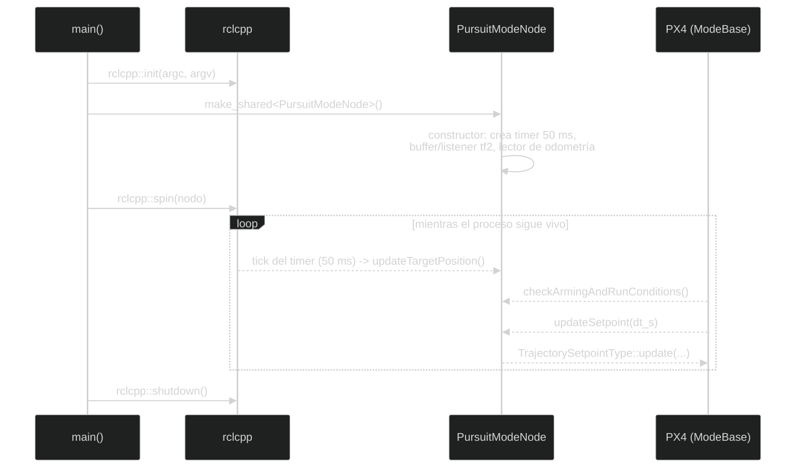

# Lectura guiada del código

Esta página prepara para leer el código propio: la sintaxis básica de C++,
el patrón que comparten casi todos los nodos, cómo se ejecuta realmente un
modo (no de arriba abajo, sino por eventos) y los errores de lectura más
frecuentes. No recorre cada archivo línea por línea — eso lo hacen, con
mucho más detalle, las tres páginas de "Análisis línea por línea" que
vienen después de esta.

Si nunca has programado, empieza por esta regla: un archivo de código es una
lista de instrucciones para el ordenador. `#include` trae herramientas ya
escritas; una **clase** agrupa datos y funciones relacionadas; una
**función** es un conjunto de instrucciones con un nombre; una **variable**
guarda un valor que puede cambiar. En C++, los símbolos `{` y `}` delimitan
un bloque de instrucciones, `;` marca normalmente el final de una
instrucción y `//` empieza un comentario que el compilador ignora. Un
**tipo** (`int`, `float`, `std::string`, etc.) indica qué clase de valor
puede guardar una variable.

Los enlaces a archivos de esta página llevan al código real del repositorio.

## Patrón común de los nodos C++

Los siguientes archivos comparten la misma estructura general —includes,
clase, constructor, callback, `main`— aunque no cada uno necesite
exactamente las mismas piezas dentro de esa estructura:

- [`interceptor_tf2_odometry.cpp`](../../src/interceptor/src/interceptor_tf2_odometry.cpp)
- [`target_tf2_odometry.cpp`](../../src/interceptor/src/target_tf2_odometry.cpp)
- [`target_vehicle_odometry_subscriber.cpp`](../../src/interceptor/src/target_vehicle_odometry_subscriber.cpp)
- [`interceptor_vehicle_odometry_subscriber.cpp`](../../src/interceptor/src/interceptor_vehicle_odometry_subscriber.cpp)
- [`tf2_listener.cpp`](../../src/interceptor/src/tf2_listener.cpp)

### Includes

- `rclcpp/rclcpp.hpp` y `px4_msgs/msg/vehicle_odometry.hpp` — comunes a los
  cinco archivos. El primero aporta `Node`, publishers, subscribers, timers
  y logging; el segundo trae el tipo `VehicleOdometry`, el mensaje que
  envía PX4.
- `geometry_msgs` y `tf2_ros` — el subconjunto que trabaja con tf2 (los dos
  conversores y `tf2_listener`) los añade encima de lo anterior; los dos
  subscriptores de diagnóstico no los necesitan, porque solo imprimen datos
  por pantalla. `geometry_msgs` trae `TransformStamped` (y además
  `TwistStamped` en `target_tf2_odometry.cpp`); `tf2_ros` trae el
  broadcaster en los conversores, y el buffer y el listener en
  `tf2_listener.cpp`.
- `memory`, `string`, `array`, `functional`, `chrono` — utilidades estándar
  de C++, repartidas según lo que necesite cada archivo.

### Constructor de un nodo

Una clase como `FramePublisher` o `VehicleOdometrySubscriber` **hereda** de
`rclcpp::Node`: reutiliza todo lo que `Node` ya sabe hacer (registrarse en
ROS 2, crear publishers, suscripciones, timers...) y le añade su propio
comportamiento encima, en vez de reescribirlo desde cero. En C++ eso se
declara así: `class FramePublisher : public rclcpp::Node`.

Justo antes de la `{` que abre el cuerpo del constructor aparece
`: Node("nombre")` — la **lista de inicialización**: antes de ejecutar nada
del cuerpo, llama al constructor de la clase base (`Node`) con ese nombre,
que es el mismo que después aparece al ejecutar `ros2 node list`.

Dentro del constructor se crean las comunicaciones: publishers, suscripciones,
timers... (ver el [glosario de Home.md](Home.md) si no recuerdas qué es cada
uno). Muchas de ellas piden un **QoS** (*Quality of Service*, "calidad de
servicio"): un conjunto de reglas sobre cómo entregar los mensajes —cuántos
guardar en cola, qué hacer si se pierde uno, etc. El perfil
`rmw_qos_profile_sensor_data` está pensado para datos de sensores: prioriza
recibir datos recientes aunque se descarte alguno antiguo.

### Callback de suscripción

```cpp
[this](const px4_msgs::msg::VehicleOdometry::UniquePtr msg) {
  // leer msg->position, msg->velocity, msg->q...
}
```

Una **lambda** es una función sin nombre, escrita directamente donde se
necesita en vez de declararla aparte. Los corchetes `[this]` son su *lista de
captura*: por defecto, una lambda no puede usar nada de fuera de sí misma;
`[this]` le da acceso explícito a los atributos y métodos del objeto en el
que está definida (por ejemplo, `vehicle_name_` en
`interceptor_tf2_odometry.cpp`) — sin `[this]`, el código de dentro no podría
leerlos. ROS 2 llama a esta lambda como *callback*, cada vez que llega un
mensaje nuevo.

`UniquePtr` es la versión de `std::unique_ptr` para este tipo de mensaje. Un
`unique_ptr` es un puntero que **posee** el objeto al que apunta: solo puede
haber un dueño a la vez, y cuando ese dueño deja de existir, el objeto se
libera automáticamente, sin que el código tenga que hacerlo a mano. Aquí, ROS
2 le entrega la propiedad del mensaje a la lambda en vez de copiarlo —de ahí
"transfiere la propiedad"—, que es más rápido que hacer una copia completa.

### `main`

Todos los nodos siguen esta secuencia:

```cpp
rclcpp::init(argc, argv);
rclcpp::spin(std::make_shared<Clase>());
rclcpp::shutdown();
```

`init` prepara ROS 2 con los argumentos de la línea de comandos.
`std::make_shared<Clase>()` crea el nodo como un `std::shared_ptr` —un
puntero que sí puede tener varios dueños a la vez, a diferencia de
`unique_ptr`, porque ROS 2 necesita compartir ese nodo internamente—. `spin`
mantiene el proceso vivo, procesando callbacks, hasta que se interrumpe (por
ejemplo con Ctrl+C); entonces `shutdown` libera los recursos de ROS 2.

## Cómo revisar o cambiar el proyecto

Para explorar el código en detalle, sigue el
[recorrido recomendado](Home.md) de la wiki: las tres páginas de "Análisis
línea por línea" ya tienen su propio orden interno. Dos hábitos prácticos que
no están en ese recorrido, y que conviene combinar con la lectura:

- No te fíes solo de haber entendido un archivo: ejecuta `ros2 topic echo`
  (o el comando equivalente) sobre el tópico que publica o consume, y
  confirma que el dato real es el que esperabas.
- Para modificar el proyecto, cambia una sola constante o fórmula cada vez,
  recompila y observa el resultado antes de tocar nada más.

Después de cada modificación:

```bash
colcon build --packages-up-to interceptor --symlink-install
source install/setup.bash
colcon test --packages-select interceptor --event-handlers console_direct+
```

Las dos primeras líneas son las mismas de
[Instalación y compilación](Installation-and-build.md): recompilar y volver a
cargar el workspace. La tercera ejecuta los *tests* del paquete — que aquí
son solo de **lint** (comprobación de estilo de código, no de que el
comportamiento sea correcto): no hay tests unitarios en este proyecto.
`--event-handlers console_direct+` hace que el resultado se imprima
directamente en la terminal en vez de quedar solo en archivos de log. Si algo
falla, ejecutar después `colcon test-result --verbose` muestra el detalle.

## Orden real de ejecución

El orden en que tú lees los archivos —el recorrido recomendado de la
wiki— no es el orden en que el programa los ejecuta. Cuando arranca
`pursuit_mode`, no se ejecuta todo el archivo de arriba abajo una sola vez:
es un programa dirigido por eventos, no una lista de instrucciones lineal.
El orden real es:

1. `main` inicializa ROS 2 y construye `PursuitModeNode`.
2. La clase base crea la infraestructura del modo PX4.
3. El constructor crea el buffer tf2, el lector de odometría y el timer.
4. `spin` queda esperando eventos.
5. Cada mensaje o timer despierta la callback correspondiente.
6. PX4 llama `checkArmingAndRunConditions` y `updateSetpoint` durante el ciclo
   del modo.



En concreto, el timer, `checkArmingAndRunConditions` y `updateSetpoint` se
disparan en momentos distintos, controlados por `spin`, no por el orden en
que están escritos en el archivo. Para depurar, pregunta siempre qué evento
ha ejecutado la línea que te interesa: llegada de odometría, tick del timer,
consulta de PX4 o mensaje de velocidad.

---

🏠 [Inicio](Home.md) · ⬅️ Anterior: [Modos de guiado](Guidance-modes.md) · ➡️ Siguiente: [Análisis línea por línea: proyecto y construcción](Line-by-line-code-analysis.md)
