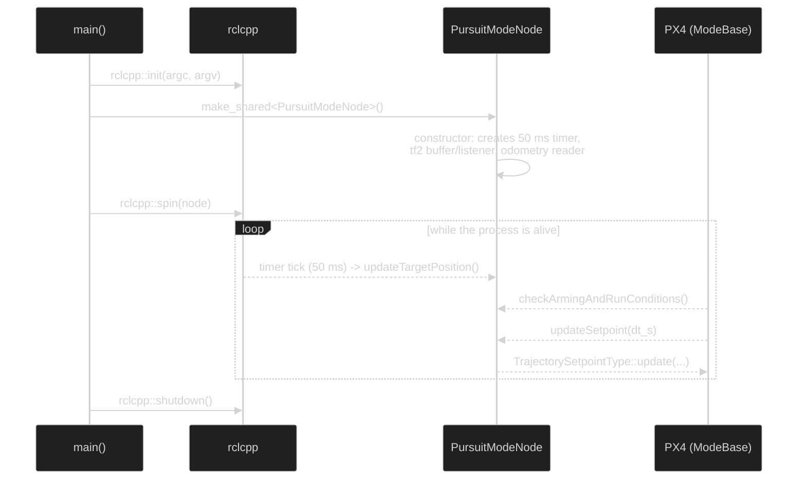

# Code walkthrough

This page gets you ready to read our own code: basic C++ syntax, the pattern
almost every node shares, how a mode really runs (not top to bottom, but
driven by events) and the most common reading mistakes. It doesn't go through
each file line by line; the three "Line by line" pages that come after this
one do that, in much more detail.

If you've never programmed, start with this rule: a code file is a list of
instructions for the computer. `#include` brings in tools that are already
written; a **class** groups related data and functions; a **function** is a
named set of instructions; a **variable** holds a value that can change. In
C++, `{` and `}` delimit a block of instructions, `;` usually marks the end of
an instruction and `//` starts a comment the compiler ignores. A **type**
(`int`, `float`, `std::string`, etc.) says what kind of value a variable can
hold.

The file links on this page go to the actual code in the repository.

## Common pattern of the C++ nodes

These files share the same overall structure (includes, class, constructor,
callback, `main`), although not every one needs exactly the same pieces inside
it:

- [`interceptor_tf2_odometry.cpp`](../../src/interceptor/src/interceptor_tf2_odometry.cpp)
- [`target_tf2_odometry.cpp`](../../src/interceptor/src/target_tf2_odometry.cpp)
- [`vehicle_odometry_subscriber.cpp`](../../src/interceptor/src/vehicle_odometry_subscriber.cpp)
- [`tf2_listener.cpp`](../../src/interceptor/src/tf2_listener.cpp)

### Includes

- `rclcpp/rclcpp.hpp` and `px4_msgs/msg/vehicle_odometry.hpp`: common to all
  four files. The first provides `Node`, publishers, subscribers, timers and
  logging; the second brings the `VehicleOdometry` type, the message PX4 sends.
- `geometry_msgs` and `tf2_ros`: the files that work with tf2 (the two
  converters and `tf2_listener`) add them on top; the diagnostic subscriber
  doesn't need them, because it only prints data. `geometry_msgs` brings
  `TransformStamped` (and also `TwistStamped` in `target_tf2_odometry.cpp`);
  `tf2_ros` brings the broadcaster in the converters, and the buffer and
  listener in `tf2_listener.cpp`.
- `memory`, `string`, `array`, `functional`, `chrono`: standard C++ utilities,
  used depending on what each file needs.

### A node's constructor

A class like `FramePublisher` or `VehicleOdometrySubscriber` **inherits** from
`rclcpp::Node`: it reuses everything `Node` already knows how to do (register
in ROS 2, create publishers, subscriptions, timers...) and adds its own
behaviour on top, instead of rewriting it from scratch. In C++ that is written
as: `class FramePublisher : public rclcpp::Node`.

Right before the `{` that opens the constructor body there is `: Node("name")`,
the **initialiser list**: before running anything in the body, it calls the
base class (`Node`) constructor with that name, which is the same one you later
see with `ros2 node list`.

The communications are created inside the constructor: publishers,
subscriptions, timers... (see the [glossary in Home.md](Home.md) if you don't
remember what each one is). Many of them ask for a **QoS** (*Quality of
Service*): a set of rules about how messages are delivered (how many to keep in
the queue, what to do if one is lost, etc.). The `rmw_qos_profile_sensor_data`
profile is meant for sensor data: it favours getting recent data even if some
older data is dropped.

### Subscription callback

```cpp
[this](const px4_msgs::msg::VehicleOdometry::UniquePtr msg) {
  // read msg->position, msg->velocity, msg->q...
}
```

A **lambda** is a function without a name, written right where it's needed
instead of being declared separately. The brackets `[this]` are its *capture
list*: by default a lambda can't use anything from outside itself; `[this]`
gives it explicit access to the members and methods of the object it's defined
in (for example, `vehicle_name_` in `interceptor_tf2_odometry.cpp`). Without
`[this]`, the code inside couldn't read them. ROS 2 calls this lambda as a
*callback* every time a new message arrives.

`UniquePtr` is the `std::unique_ptr` version for this message type. A
`unique_ptr` is a pointer that **owns** the object it points to: there can be
only one owner at a time, and when that owner goes away the object is freed
automatically, without the code having to do it by hand. Here, ROS 2 hands
ownership of the message to the lambda instead of copying it, which is faster
than making a full copy.

### `main`

Every node follows this sequence:

```cpp
rclcpp::init(argc, argv);
rclcpp::spin(std::make_shared<Class>());
rclcpp::shutdown();
```

`init` sets up ROS 2 with the command-line arguments.
`std::make_shared<Class>()` creates the node as a `std::shared_ptr`, a pointer
that can have several owners at once (unlike `unique_ptr`), because ROS 2
needs to share that node internally. `spin` keeps the process alive,
processing callbacks, until it's interrupted (for example with Ctrl+C); then
`shutdown` releases the ROS 2 resources.

## How to review or change the project

To explore the code in detail, follow the wiki's
[suggested reading order](Home.md): the three "Line by line" pages already
have their own internal order. Two practical habits that aren't in that order,
and that are worth combining with the reading:

- Don't rely only on having understood a file: run `ros2 topic echo` (or the
  equivalent command) on the topic it publishes or consumes, and check that the
  real data is what you expected.
- To change the project, change one constant or formula at a time, rebuild and
  look at the result before touching anything else.

After each change:

```bash
colcon build --packages-up-to interceptor --symlink-install
source install/setup.bash
colcon test --packages-select interceptor --event-handlers console_direct+
```

The first two lines are the same as in
[Installation and build](Installation-and-build.md): rebuild and reload the
workspace. The third runs the package *tests*, which here are only **lint**
(code style checks, not checks that the behaviour is correct): there are no
unit tests in this project. `--event-handlers console_direct+` prints the
result straight to the terminal instead of leaving it only in log files. If
something fails, `colcon test-result --verbose` shows the details.

## Actual order of execution

The order in which you read the files (the wiki's reading order) is not the
order in which the program runs them. When `pursuit_mode` starts, the file is
not run once from top to bottom: it's an event-driven program, not a linear
list of instructions. The actual order is:

1. `main` initialises ROS 2 and builds `PursuitModeNode`.
2. The base class creates the PX4 mode infrastructure.
3. The constructor creates the tf2 buffer, the odometry reader and the timer.
4. `spin` waits for events.
5. Each message or timer wakes up the matching callback.
6. PX4 calls `checkArmingAndRunConditions` and `updateSetpoint` during the
   mode's cycle.



In particular, the timer, `checkArmingAndRunConditions` and `updateSetpoint`
fire at different moments, controlled by `spin`, not by the order in which
they're written in the file. When debugging, always ask which event ran the
line you're interested in: odometry arriving, a timer tick, a PX4 query or a
velocity message.

---

🏠 [Home](Home.md) · ⬅️ Previous: [Guidance modes](Guidance-modes.md) · ➡️ Next: [Line by line: project and build files](Line-by-line-project-and-build-files.md)
