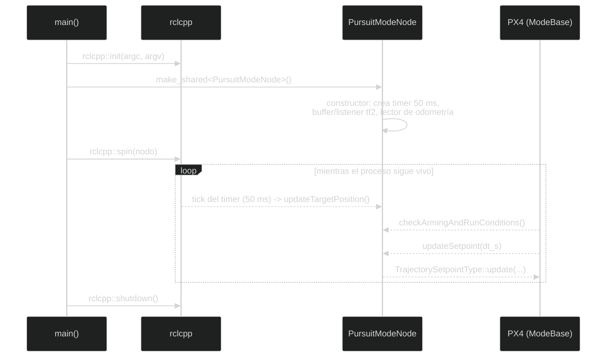

# Lectura guiada del código

Esta página explica qué hace cada parte importante de los archivos propios del
paquete y cómo se relacionan entre sí:

Si nunca has programado, empieza por esta regla: un archivo de código es una
lista de instrucciones que el ordenador ejecuta siguiendo eventos. Las palabras
que empiezan por `#include` traen herramientas ya escritas; una **clase** agrupa
datos y funciones relacionadas; una **función** es un conjunto de instrucciones
con un nombre; una **variable** guarda un valor que puede cambiar.

1. Los `#include` importan las herramientas necesarias.
2. La clase hereda de `rclcpp::Node` o de `px4_ros2::ModeBase`.
3. El constructor crea publishers, subscribers, timers y parámetros.
4. Las callbacks reaccionan a mensajes o a temporizadores.
5. `main` inicializa ROS 2, mantiene el nodo vivo y lo apaga correctamente.

En C++, los símbolos `{` y `}` delimitan un bloque de instrucciones, `;` marca
normalmente el final de una instrucción y `//` empieza un comentario que el
compilador ignora. Un **tipo** (`int`, `float`, `std::string`, etc.) indica qué
clase de valor puede guardar una variable.

Los enlaces a los archivos llevan al código real del repositorio. La explicación
describe el comportamiento actual, incluidos detalles que conviene revisar antes
de refactorizar.

## 1. `CMakeLists.txt`: cómo se construye el paquete

Archivo: [`src/interceptor/CMakeLists.txt`](../../src/interceptor/CMakeLists.txt)

### Configuración inicial

```cmake
cmake_minimum_required(VERSION 3.8)
project(interceptor)
```

`cmake_minimum_required` fija la versión mínima de CMake y `project` da nombre al
paquete de compilación. El nombre debe coincidir con el de `package.xml`.

```cmake
if(CMAKE_COMPILER_IS_GNUCXX OR CMAKE_CXX_COMPILER_ID MATCHES "Clang")
  add_compile_options(-Wall -Wextra -Wpedantic)
endif()
```

Para GCC o Clang activa advertencias del compilador: errores habituales,
variables no usadas y construcciones poco portables. Las advertencias ayudan a
aprender qué está haciendo C++.

### Dependencias

Cada `find_package(... REQUIRED)` busca una biblioteca ROS 2 o PX4 necesaria
para compilar. Por ejemplo, `rclcpp` permite crear nodos, `tf2_ros` permite
publicar/escuchar transformaciones, y `px4_ros2_cpp` permite crear modos PX4.

`ament_target_dependencies` repite esas dependencias para cada ejecutable. Esto
hace que los includes y las bibliotecas estén disponibles para ese programa, no
para todos automáticamente.

### Ejecutables

Cada bloque de la forma:

```cmake
add_executable(pursuit_mode src/pursuit_mode.cpp)
ament_target_dependencies(pursuit_mode rclcpp tf2_ros ...)
```

produce un binario llamado `pursuit_mode` a partir del archivo indicado. Lo mismo
ocurre con `PN_mode`, los dos conversores tf2, los dos suscriptores de
diagnóstico y `tf2_listener`.

### Tests e instalación

`BUILD_TESTING` activa los tests de lint de ROS 2. Las dos variables terminadas
en `_FOUND` desactivan comprobaciones de copyright y cpplint para este paquete,
como explican sus comentarios.

`install(TARGETS ...)` copia los binarios a la instalación de ROS 2, y
`install(DIRECTORY launch ...)` copia el launch file. Sin estas reglas,
`ros2 run` y `ros2 launch` no encontrarían los programas tras compilar.

## 2. `package.xml`: metadatos y dependencias

Archivo: [`src/interceptor/package.xml`](../../src/interceptor/package.xml)

- La etiqueta `<name>` identifica el paquete.
- `<version>`, `<description>`, `<maintainer>` y `<license>` describen el
  proyecto para ROS 2.
- `<buildtool_depend>ament_cmake</buildtool_depend>` indica quién ejecuta la
  configuración de CMake.
- Cada `<depend>` es una dependencia necesaria durante compilación y ejecución.
- `launch` y `launch_ros` son `exec_depend` porque el código Python se ejecuta al
  lanzar, pero no compila los binarios C++.
- `ament_lint_auto` y `ament_lint_common` solo son dependencias de test.
- `<build_type>ament_cmake</build_type>` le dice a ROS 2 cómo construir el
  paquete.

Cuando se añade un include de otro paquete, hay que comprobar si también se
necesita añadirlo aquí y en `CMakeLists.txt`.

## 3. `interceptor.launch.py`: composición del sistema

Archivo: [`src/interceptor/launch/interceptor.launch.py`](../../src/interceptor/launch/interceptor.launch.py)

### Imports y ruta del agente

`os` permite expandir `~` en la ruta del usuario. `LaunchDescription` representa
la lista de acciones y `ExecuteProcess`/`Node` arrancan procesos.

```python
MICRO_XRCE_DDS_AGENT_DIR = os.path.expanduser('~/Micro-XRCE-DDS-Agent')
```

El launch presupone que el agente está en esa carpeta.

### `generate_launch_description`

ROS 2 llama a esta función cuando ejecutamos `ros2 launch`. La acción
`ExecuteProcess` ejecuta `MicroXRCEAgent udp4 -p 8888` dentro de la carpeta del
agente. `shell=True` permite ejecutar esa cadena como comando de shell y
`output='log'` envía su salida a los logs.

Cada `Node` indica tres cosas: paquete, ejecutable y dónde mostrar su salida.
Así se arrancan los dos suscriptores, los dos conversores tf2 y los dos modos.
El `tf2_listener` está definido en comentarios, por lo que no se inicia.

La lista que devuelve `LaunchDescription` es el orden de las acciones. PX4 SITL
no aparece en ella: se inicia manualmente en otras terminales.

## 4. Patrón común de los nodos C++

Los siguientes archivos usan el mismo patrón:

- [`interceptor_tf2_odometry.cpp`](../../src/interceptor/src/interceptor_tf2_odometry.cpp)
- [`target_tf2_odometry.cpp`](../../src/interceptor/src/target_tf2_odometry.cpp)
- [`target_vehicle_odometry_subscriber.cpp`](../../src/interceptor/src/target_vehicle_odometry_subscriber.cpp)
- [`interceptor_vehicle_odometry_subscriber.cpp`](../../src/interceptor/src/interceptor_vehicle_odometry_subscriber.cpp)
- [`tf2_listener.cpp`](../../src/interceptor/src/tf2_listener.cpp)

### Includes

`rclcpp/rclcpp.hpp` proporciona `Node`, publishers, subscribers, timers y
logging. Los headers de `px4_msgs` contienen el tipo `VehicleOdometry`.
`geometry_msgs` contiene mensajes estándar como `TransformStamped` y
`TwistStamped`. Los headers `tf2_ros` ofrecen broadcaster, buffer y listener.
`memory`, `string`, `array`, `functional` y `chrono` son utilidades estándar de
C++.

### Constructor de un nodo

Una clase como `FramePublisher` o `VehicleOdometrySubscriber` hereda de
`rclcpp::Node`. La lista `: Node("nombre")` llama al constructor base y registra
el nombre visible con `ros2 node list`.

Dentro del constructor se crean las comunicaciones. El QoS
`rmw_qos_profile_sensor_data` está pensado para datos de sensores: prioriza
recibir datos recientes aunque se descarte alguno antiguo.

### Callback de suscripción

```cpp
[this](const px4_msgs::msg::VehicleOdometry::UniquePtr msg) {
  // leer msg->position, msg->velocity, msg->q...
}
```

Una lambda es una función anónima. `[this]` permite acceder a los atributos del
objeto. ROS 2 llama la lambda cada vez que llega un mensaje. `UniquePtr`
transfiere temporalmente la propiedad del mensaje y evita copias innecesarias.

### `main`

Todos los nodos siguen esta secuencia:

```cpp
rclcpp::init(argc, argv);
rclcpp::spin(std::make_shared<Clase>());
rclcpp::shutdown();
```

`init` prepara ROS 2, `make_shared` construye el nodo, `spin` procesa callbacks
hasta que el proceso termina y `shutdown` libera los recursos de ROS 2.

## 5. `interceptor_tf2_odometry.cpp`

### Objetivo y nodo

`FramePublisher` recibe `/fmu/out/vehicle_odometry`, que corresponde a la
instancia 0, y publica `map -> interceptor/base_link`.

El parámetro `vehicle_name` permite cambiar el nombre del frame sin recompilar;
su valor por defecto es `interceptor`.

### Conversión de posición y orientación

El mensaje PX4 contiene posición NED y un cuaternión PX4. El código construye
`Eigen::Vector3d position_ned`, llama a
`ned_to_enu_local_frame` y obtiene `position_enu`. Hace algo equivalente con
`Eigen::Quaterniond` y `px4_to_ros_orientation`.

Esto es esencial: no basta con copiar números, porque NED y ENU tienen ejes y
signos diferentes.

### Transformación tf2

`TransformStamped t` contiene:

- `header.stamp`: instante de publicación.
- `header.frame_id = "map"`: marco padre.
- `child_frame_id`: marco del vehículo.
- `translation`: posición ENU.
- `rotation`: orientación convertida.

`sendTransform(t)` publica el resultado al árbol tf2. Este archivo no publica
velocidad porque el interceptor no la necesita para crear su frame.

## 6. `target_tf2_odometry.cpp`

Es casi igual al conversor del interceptor, pero escucha
`/px4_1/fmu/out/vehicle_odometry`, correspondiente a la instancia 1.

### Publicación de velocidad

Además del broadcaster crea un publisher de `TwistStamped` en
`target/velocity`. El timer de 100 ms equivale a 10 Hz. Cada vez que dispara:

1. crea un mensaje;
2. pone la hora y el frame;
3. copia la última velocidad ENU guardada;
4. publica el mensaje.

La callback de odometría convierte `msg->velocity` de NED a ENU y guarda el
resultado en `_target_velocity_enu`. El `cast<float>()` convierte de
`Vector3d` a `Vector3f`, porque el atributo está declarado con `float`.

La separación entre callback de odometría y timer evita que la publicación de
velocidad dependa exactamente de cuándo llega cada mensaje PX4.

## 7. Suscriptores de odometría para diagnóstico

Archivos:

- [`target_vehicle_odometry_subscriber.cpp`](../../src/interceptor/src/target_vehicle_odometry_subscriber.cpp)
- [`interceptor_vehicle_odometry_subscriber.cpp`](../../src/interceptor/src/interceptor_vehicle_odometry_subscriber.cpp)

Ambos crean un `VehicleOdometrySubscriber`, configuran QoS de sensor y muestran
por consola timestamp, marco, posición, cuaternión, velocidad y módulo de la
velocidad. La fórmula:

```cpp
sqrt(vx * vx + vy * vy + vz * vz)
```

es la longitud del vector velocidad.

Estos programas no transforman datos ni controlan drones: sirven para inspeccionar
qué publica PX4 y comprobar si llega información.

### Detalle que hay que conocer

En el estado actual, el archivo llamado `target_vehicle_odometry_subscriber`
escucha `/fmu/out/vehicle_odometry` (instancia 0), mientras que
`interceptor_vehicle_odometry_subscriber` escucha `px4_1/fmu/out/vehicle_odometry`
(instancia 1). Los nombres parecen invertidos respecto a su significado.
Documentarlo evita que una persona nueva diagnostique el vehículo equivocado.

## 8. `tf2_listener.cpp`

`FrameListener` es un nodo de inspección, no un controlador.

1. Declara `target_frame`, por defecto `target/base_link`.
2. Crea un `tf2_ros::Buffer`, que almacena transformaciones.
3. Crea un `TransformListener`, que llena ese buffer escuchando tf2.
4. Se suscribe a la odometría del target para recordar su velocidad NED.
5. Crea un timer de un segundo.

En `on_timer`, `lookupTransform("interceptor/base_link", target_frame, ...)`
solicita la posición del target expresada respecto al interceptor. Si falta algún
frame, `tf2::TransformException` se captura y se registra un mensaje.

Si la consulta funciona, `RCLCPP_INFO` imprime la traslación y la última
velocidad. El nodo no modifica ningún setpoint. En el launch está comentado para
que sea opcional.

## 9. Qué tienen en común los dos modos

Archivos:

- [`pursuit_mode.cpp`](../../src/interceptor/src/pursuit_mode.cpp)
- [`PN_mode.cpp`](../../src/interceptor/src/PN_mode.cpp)

### Includes y constantes

`Eigen` proporciona vectores y operaciones matemáticas. `ModeBase` y
`NodeWithMode` vienen de la biblioteca PX4-ROS 2. `TrajectorySetpointType`
representa la orden de trayectoria. `OdometryLocalPosition` entrega posición y
velocidad propias. `tf2_ros::Buffer` y `TransformListener` permiten leer la
posición del target.

`kName` es el nombre que PX4 muestra para el modo y `kMapFrame` es el frame padre
de la consulta tf2. `using namespace std::chrono_literals` permite escribir
`50ms` en vez de construir manualmente una duración.

### Constructor

Los modos construyen el objeto de setpoint y el lector de odometría propia.
Declaran `target_frame`, crean buffer/listener y programan
`updateTargetPosition()` cada 50 ms.

El modo PN añade `target_velocity_topic` y una suscripción `TwistStamped`. Su
callback convierte la velocidad ENU recibida a NED y activa
`_target_velocity_valid`.

### Comprobación de armado

`checkArmingAndRunConditions` es una barrera de seguridad. Si faltan datos, usa
`armingCheckFailureExt` para impedir que PX4 considere el modo listo. Pursuit
necesita posición; PN necesita posición y velocidad.

### Consulta tf2

`lookupTransform("map", "target/base_link", tf2::TimePointZero)` pide la última
transformación disponible. El `try/catch` evita que una transformación ausente
termine el nodo. `RCLCPP_WARN_THROTTLE` limita el warning a uno cada 5 segundos.

La traslación recibida es ENU, se convierte a NED y se guarda en
`_target_position_ned`. Solo entonces `_target_valid` pasa a `true`.

### Setpoint común

`los` significa *line of sight*: es la diferencia entre posición del target y
posición propia. `los.norm()` calcula la distancia. Si es menor que 1 m, se
llama a `completed(Success)`.

La parte horizontal normaliza `los`, la multiplica por el límite de velocidad y
actualiza el yaw con `atan2f`. La parte vertical usa `std::clamp` para no
superar el límite. Finalmente `TrajectorySetpointType::update` recibe
velocidad, aceleración opcional y yaw.

## 10. Diferencia interna de `pursuit_mode`

Archivo: [`pursuit_mode.cpp`](../../src/interceptor/src/pursuit_mode.cpp)

Pursuit pasa `{}` como aceleración: solo solicita velocidad. Sus límites son
`5 m/s` horizontal, `2 m/s` vertical y `0.1 m` como distancia mínima horizontal
para evitar normalizar un vector casi cero. `_last_yaw` conserva el último yaw
válido cuando el vehículo está prácticamente alineado verticalmente.

## 11. Diferencia interna de `PN_mode`

Archivo: [`PN_mode.cpp`](../../src/interceptor/src/PN_mode.cpp)

PN calcula:

```text
v_rel = velocidad_target - velocidad_interceptor
omega = (los × v_rel) / (los · los)
a_cmd = N * (omega × v_rel)
```

El `1e-6` del denominador evita dividir por cero. Si la aceleración es muy
pequeña se usa cero; si supera `kMaxAcceleration`, se normaliza y se recorta.
Por debajo de `kPnMinRange` (`7 m`) se desactiva la aceleración PN, aunque se
sigue enviando la velocidad de persecución.

PN usa velocidad horizontal máxima de `7 m/s`, aceleración máxima de `3 m/s²` y
constante de navegación `3.5`. El parámetro `dt_s` se recibe porque forma parte
de la interfaz de `ModeBase`, pero actualmente se ignora con `(void)dt_s`.

## 12. Cómo revisar o cambiar el proyecto

Un orden recomendable para revisar el proyecto es:

1. Leer `CMakeLists.txt` para ver qué programas existen.
2. Leer un suscriptor de diagnóstico para entender callbacks.
3. Leer un conversor tf2 para entender marcos.
4. Ejecutar `ros2 topic echo` y comprobar esos datos.
5. Leer `pursuit_mode.cpp` para entender el setpoint más sencillo.
6. Compararlo con `PN_mode.cpp`.
7. Cambiar una constante de forma aislada, recompilar y observar el resultado.

Después de cada modificación:

```bash
colcon build --packages-up-to interceptor --symlink-install
source install/setup.bash
colcon test --packages-select interceptor --event-handlers console_direct+
```

## Cómo seguir una ejecución con el depurador mental

Cuando arranca `pursuit_mode`, no se ejecuta todo el archivo de arriba abajo una
sola vez. El orden real es:

1. `main` inicializa ROS 2 y construye `PursuitModeNode`.
2. La clase base crea la infraestructura del modo PX4.
3. El constructor crea el buffer tf2, el lector de odometría y el timer.
4. `spin` queda esperando eventos.
5. Cada mensaje o timer despierta la callback correspondiente.
6. PX4 llama `checkArmingAndRunConditions` y `updateSetpoint` durante el ciclo
   del modo.



No existe una sola llamada que "ejecute el algoritmo de arriba abajo": el
timer, `checkArmingAndRunConditions` y `updateSetpoint` se disparan en momentos
distintos, controlados por `spin`, no por el orden en que están escritos en el
archivo.

Este modelo de eventos es diferente de un programa que contiene un `while` con
todo el algoritmo. Para depurar, pregunta siempre qué evento ha ejecutado la
línea: llegada de odometría, tick del timer, consulta de PX4 o mensaje de
velocidad.

## Tipos de C++ que aparecen repetidamente

| Tipo | Motivo de uso |
| --- | --- |
| `std::string` | Nombres de tópicos, parámetros y frames. |
| `std::shared_ptr` | Recursos compartidos cuya vida se gestiona automáticamente. |
| `std::unique_ptr` | Recurso con un único propietario, como un broadcaster o buffer. |
| `Eigen::Vector3f` | Vector de tres componentes `float`. |
| `Eigen::Vector3d` | Vector de tres componentes `double`. |
| `bool` | Estado de validez de datos. |
| `std::clamp` | Limitar un valor entre mínimo y máximo. |
| lambda `[this](...) { ... }` | Callback breve asociada a ROS 2. |

La diferencia entre `float` y `double` importa cuando se convierten mensajes:
las funciones de transformación suelen trabajar con `double`, mientras que
algunos estados de control se guardan como `float`. `.cast<float>()` realiza
esa conversión de forma explícita.

## Errores habituales al leer el código

- Confundir el nombre del archivo con el tópico real al que se suscribe.
- Suponer que `tf2` contiene velocidad: aquí solo contiene posición y
  orientación.
- Pensar que `completed()` apaga PX4; indica a la biblioteca que el modo ha
  terminado correctamente.
- Olvidar que `spin()` es lo que permite que callbacks y timers se ejecuten.
- Cambiar el orden NED/ENU sin modificar todas las partes relacionadas.

Estas diferencias son más importantes que memorizar la sintaxis de cada include.

---

🏠 [Inicio](Home.md) · ⬅️ Anterior: [Modos de guiado](Guidance-modes.md) · ➡️ Siguiente: [Análisis línea por línea: proyecto y construcción](Line-by-line-code-analysis.md)
