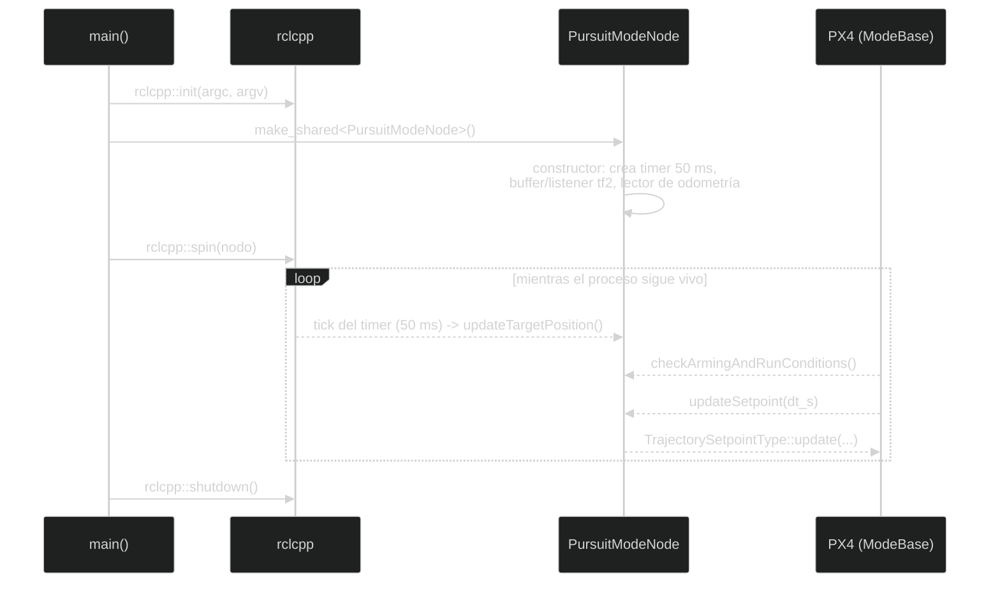

# Lectura guiada del código

Esta página prepara para leer el código propio: la sintaxis básica de C++,
el patrón que comparten casi todos los nodos, cómo se ejecuta realmente un
modo (no de arriba abajo, sino por eventos) y los errores de lectura más
frecuentes. No recorre cada archivo línea por línea — eso lo hacen, con
mucho más detalle, las tres páginas de "Análisis línea por línea" que
vienen después de esta.

Si nunca has programado, empieza por esta regla: un archivo de código es una
lista de instrucciones que el ordenador ejecuta siguiendo eventos. Las palabras
que empiezan por `#include` traen herramientas ya escritas; una **clase** agrupa
datos y funciones relacionadas; una **función** es un conjunto de instrucciones
con un nombre; una **variable** guarda un valor que puede cambiar.

1. Los `#include` importan las herramientas necesarias.
2. La clase hereda de `rclcpp::Node` o de `px4_ros2::ModeBase`.
3. El constructor crea publishers, subscribers, timers y parámetros.
4. Las callbacks reaccionan a mensajes o a temporizadores.
5. `main` inicializa ROS 2, mantiene el nodo vivo y lo apaga correctamente.

En C++, los símbolos `{` y `}` delimitan un bloque de instrucciones, `;` marca
normalmente el final de una instrucción y `//` empieza un comentario que el
compilador ignora. Un **tipo** (`int`, `float`, `std::string`, etc.) indica qué
clase de valor puede guardar una variable.

Los enlaces a archivos de esta página llevan al código real del repositorio.

## Patrón común de los nodos C++

Los siguientes archivos usan el mismo patrón:

- [`interceptor_tf2_odometry.cpp`](../../src/interceptor/src/interceptor_tf2_odometry.cpp)
- [`target_tf2_odometry.cpp`](../../src/interceptor/src/target_tf2_odometry.cpp)
- [`target_vehicle_odometry_subscriber.cpp`](../../src/interceptor/src/target_vehicle_odometry_subscriber.cpp)
- [`interceptor_vehicle_odometry_subscriber.cpp`](../../src/interceptor/src/interceptor_vehicle_odometry_subscriber.cpp)
- [`tf2_listener.cpp`](../../src/interceptor/src/tf2_listener.cpp)

### Includes

`rclcpp/rclcpp.hpp` proporciona `Node`, publishers, subscribers, timers y
logging. Los headers de `px4_msgs` contienen el tipo `VehicleOdometry`.
`geometry_msgs` contiene mensajes estándar como `TransformStamped` y
`TwistStamped`. Los headers `tf2_ros` ofrecen broadcaster, buffer y listener.
`memory`, `string`, `array`, `functional` y `chrono` son utilidades estándar de
C++.

### Constructor de un nodo

Una clase como `FramePublisher` o `VehicleOdometrySubscriber` hereda de
`rclcpp::Node`. La lista `: Node("nombre")` llama al constructor base y registra
el nombre visible con `ros2 node list`.

Dentro del constructor se crean las comunicaciones. El QoS
`rmw_qos_profile_sensor_data` está pensado para datos de sensores: prioriza
recibir datos recientes aunque se descarte alguno antiguo.

### Callback de suscripción

```cpp
[this](const px4_msgs::msg::VehicleOdometry::UniquePtr msg) {
  // leer msg->position, msg->velocity, msg->q...
}
```

Una lambda es una función anónima. `[this]` permite acceder a los atributos del
objeto. ROS 2 llama la lambda cada vez que llega un mensaje. `UniquePtr`
transfiere temporalmente la propiedad del mensaje y evita copias innecesarias.

### `main`

Todos los nodos siguen esta secuencia:

```cpp
rclcpp::init(argc, argv);
rclcpp::spin(std::make_shared<Clase>());
rclcpp::shutdown();
```

`init` prepara ROS 2, `make_shared` construye el nodo, `spin` procesa callbacks
hasta que el proceso termina y `shutdown` libera los recursos de ROS 2.

## Cómo revisar o cambiar el proyecto

Un orden recomendable para revisar el proyecto es (los tres primeros pasos
tienen su detalle línea por línea en las páginas siguientes de esta wiki):

1. Leer `CMakeLists.txt` para ver qué programas existen — ver
   [Archivos de proyecto y construcción](Line-by-line-code-analysis.md).
2. Leer un suscriptor de diagnóstico para entender callbacks — ver
   [Nodos de odometría y tf2](Line-by-line-odometry-nodes.md).
3. Leer un conversor tf2 para entender marcos — misma página anterior.
4. Ejecutar `ros2 topic echo` y comprobar esos datos.
5. Leer `pursuit_mode.cpp` para entender el setpoint más sencillo — ver
   [Modos de guiado, línea por línea](Line-by-line-guidance-modes.md).
6. Compararlo con `PN_mode.cpp`.
7. Cambiar una constante de forma aislada, recompilar y observar el resultado.

Después de cada modificación:

```bash
colcon build --packages-up-to interceptor --symlink-install
source install/setup.bash
colcon test --packages-select interceptor --event-handlers console_direct+
```

## Cómo seguir una ejecución con el depurador mental

El orden de la sección anterior es el orden en que **tú** lees los archivos.
El orden en que **el programa** ejecuta las cosas es otro completamente
distinto, y es el que hace falta para depurar. Cuando arranca `pursuit_mode`,
no se ejecuta todo el archivo de arriba abajo una sola vez: es un programa
dirigido por eventos, no una lista de instrucciones lineal. El orden real es:

1. `main` inicializa ROS 2 y construye `PursuitModeNode`.
2. La clase base crea la infraestructura del modo PX4.
3. El constructor crea el buffer tf2, el lector de odometría y el timer.
4. `spin` queda esperando eventos.
5. Cada mensaje o timer despierta la callback correspondiente.
6. PX4 llama `checkArmingAndRunConditions` y `updateSetpoint` durante el ciclo
   del modo.



No existe una sola llamada que "ejecute el algoritmo de arriba abajo": el
timer, `checkArmingAndRunConditions` y `updateSetpoint` se disparan en momentos
distintos, controlados por `spin`, no por el orden en que están escritos en el
archivo.

Este modelo de eventos es diferente de un programa que contiene un `while` con
todo el algoritmo. Para depurar, pregunta siempre qué evento ha ejecutado la
línea: llegada de odometría, tick del timer, consulta de PX4 o mensaje de
velocidad.

## Tipos de C++ que aparecen repetidamente

| Tipo | Motivo de uso |
| --- | --- |
| `std::string` | Nombres de tópicos, parámetros y frames. |
| `std::shared_ptr` | Recursos compartidos cuya vida se gestiona automáticamente. |
| `std::unique_ptr` | Recurso con un único propietario, como un broadcaster o buffer. |
| `Eigen::Vector3f` | Vector de tres componentes `float`. |
| `Eigen::Vector3d` | Vector de tres componentes `double`. |
| `bool` | Estado de validez de datos. |
| `std::clamp` | Limitar un valor entre mínimo y máximo. |
| lambda `[this](...) { ... }` | Callback breve asociada a ROS 2. |

La diferencia entre `float` y `double` importa cuando se convierten mensajes:
las funciones de transformación suelen trabajar con `double`, mientras que
algunos estados de control se guardan como `float`. `.cast<float>()` realiza
esa conversión de forma explícita.

## Errores habituales al leer el código

- Confundir el nombre del archivo con el tópico real al que se suscribe.
- Suponer que `tf2` contiene velocidad: aquí solo contiene posición y
  orientación.
- Pensar que `completed()` apaga PX4; indica a la biblioteca que el modo ha
  terminado correctamente.
- Olvidar que `spin()` es lo que permite que callbacks y timers se ejecuten.
- Cambiar el orden NED/ENU sin modificar todas las partes relacionadas.

Estas diferencias son más importantes que memorizar la sintaxis de cada include.

---

🏠 [Inicio](Home.md) · ⬅️ Anterior: [Modos de guiado](Guidance-modes.md) · ➡️ Siguiente: [Análisis línea por línea: proyecto y construcción](Line-by-line-code-analysis.md)
