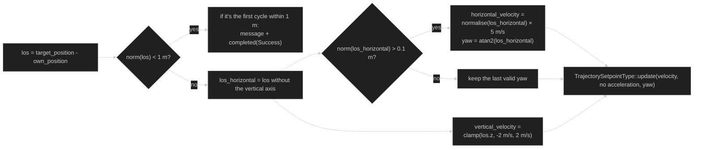
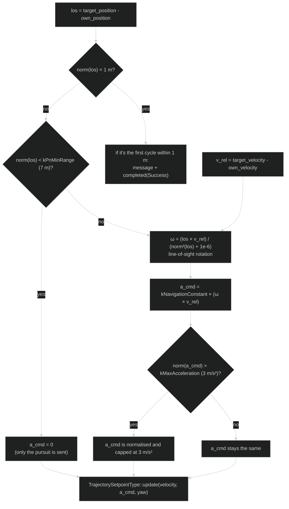

# Guidance modes

A **guidance mode** is a strategy that decides where the interceptor should
move. It doesn't drive the motors directly: it computes references and PX4
takes care of flight control. An **algorithm** is just an ordered recipe of
calculations that leads to a decision.

## Motion and maths terms

| Term | Plain meaning |
| --- | --- |
| **Position** | Where the vehicle is, usually as three numbers: east/west, north/south and height. |
| **Velocity** | How fast and in which direction it moves. |
| **Acceleration** | How the velocity changes. |
| **Yaw** | Rotation of the vehicle around the vertical axis; seen from above, where the nose points. |
| **Vector** | An ordered group of numbers that represents a direction and a size. |
| **Norm** | The length or size of a vector; used here to compute a distance. |
| **Normalise** | Turn a vector into one of length 1 while keeping its direction. |
| **Relative velocity** | The target's velocity compared with the interceptor's: target minus interceptor. |
| **Line of sight (LOS)** | Imaginary arrow from the interceptor to the target. |
| **Cross product** | An operation between vectors that helps measure how the direction of a line changes. |
| **Arm** | Give PX4 permission so the vehicle can enable its motors/controllers. |

For example, if the interceptor is at `(0, 0, 0)` and the target at
`(10, 0, 0)`, the line of sight points along the positive first axis and its
norm is `10`. There's no need to compute the products by hand: Eigen and the
library functions do those operations; what matters is knowing what each
result represents.

Both modes are C++ classes derived from `px4_ros2::ModeBase` and wrapped in
`px4_ros2::NodeWithMode`. This lets PX4 know them as custom flight modes.

## Common cycle

Each mode:

1. Creates a `TrajectorySetpointType`, the output channel of the `px4_ros2`
   library for sending commands to PX4 (velocity, acceleration and yaw).
2. Creates an `OdometryLocalPosition`, the matching input channel to read the
   **interceptor's own** position and velocity (the vehicle running the
   mode), without going through tf2 or any topic.
3. Looks up `map -> target/base_link` every 50 ms.
4. Refuses to arm if there is no valid target data yet.
5. Computes a setpoint in `updateSetpoint`.
6. Calls `completed(Success)` the first time the distance drops below 1 m.

If tf2 doesn't know the target yet, the mode logs a warning and doesn't
generate a valid setpoint.

`completed()` doesn't shut PX4 down or land the vehicle: it only tells the
`px4_ros2` library that this mode has finished its task successfully. What
happens next (landing, holding position, switching modes...) is decided by
PX4 or whoever is flying, not by this code.

Since the mode stays active, `updateSetpoint` keeps running every cycle while
the interceptor is within 1 m. An internal flag (`_target_reached`) makes the
message and `completed()` happen **only once per approach**: it is reset when
the interceptor moves more than 1 m away again (and the chase resumes) and
also when the mode is activated. Without that flag, the log got dozens of
lines per second.

## What a setpoint is

A setpoint is not an instant "move the motor like this" command. It is a
reference for PX4's controller. This project mainly sends velocity, yaw and,
in PN, acceleration. PX4 combines that reference with its estimators, limits
and internal controllers.

That's why changing a speed constant doesn't teleport the drone: the
autopilot still applies its own dynamics and constraints.

## `pursuit_mode`: pure pursuit

This mode points straight at the target's current position:

- Maximum horizontal speed: `5 m/s`.
- Vertical speed limited to `2 m/s`.
- Yaw follows the horizontal line of sight.
- It doesn't need `target/velocity`.

It's the simplest algorithm for understanding the whole flow: target
position, difference with our own position, and velocity towards the target.

### Conceptual example

If the target is 10 m to the east and 2 m above, the horizontal vector is
normalised and multiplied by `5 m/s`; the vertical component is limited to
`2 m/s`. If the target is almost exactly above, the horizontal yaw is not
recomputed and the last valid yaw is kept.

### From position to setpoint, step by step

This diagram is literally the body of `updateSetpoint` in `pursuit_mode.cpp`,
without the code: each box is a line or a small group of lines, and each arrow
is the real order in which they run.

## `PN_mode`: proportional navigation

This mode uses:

- The target position from tf2.
- The target velocity from `target/velocity`.
- The interceptor's own velocity.
- The relative velocity between the two.

It computes the rotation of the line of sight and generates a proportional
navigation acceleration. Its current limits are:

| Constant | Value | Meaning |
| --- | ---: | --- |
| `kMaxHorizontalSpeed` | `7 m/s` | Maximum horizontal speed. |
| `kMaxVerticalSpeed` | `2 m/s` | Maximum vertical speed. |
| `kNavigationConstant` | `3.5` | Proportional navigation gain. |
| `kMaxAcceleration` | `3 m/s²` | Maximum requested acceleration. |
| `kPnMinRange` | `7 m` | Below this distance no PN acceleration is applied. |

PN can't work properly if `target_tf2_odometry` doesn't publish
`target/velocity`. The mode also blocks arming until it has received both
position and velocity.

### How the PN acceleration is computed

In the diagram, `×` means different things depending on what it multiplies:
between `los` and `v_rel`, or between `ω` and `v_rel`, it is the **cross
product** from the table above (two vectors); between `kNavigationConstant`
and a vector, it is a normal multiplication by a number.

The horizontal/vertical pursuit velocity (the same as in `pursuit_mode`, but
with `7 m/s` instead of `5 m/s`) is always computed and sent; `a_cmd` is an
extra that is only switched on above `kPnMinRange`. That's why PN never stops
chasing, even when the PN acceleration is off.

### The intuition behind proportional navigation

PN doesn't only aim at the current position. It looks at how the line joining
interceptor and target rotates. If that line rotates, the target may cross in
front without being reached; the PN acceleration tries to correct that
geometry. The gain `kNavigationConstant` makes the correction more or less
aggressive, but it doesn't remove the safety limits.

## Comparison

| Feature | Pursuit | PN |
| --- | --- | --- |
| Target position | Yes | Yes |
| Target velocity | No | Yes |
| Computed acceleration | No | Yes |
| Maximum horizontal speed | `5 m/s` | `7 m/s` |
| Complexity | Lower | Higher |

The constants live in the source files; there are no external parameters or
dynamic reconfiguration.

## Valid data and stale data

The `_target_valid` and `_target_velocity_valid` flags only say that at least
one piece of data has arrived. On their own they don't check that the data is
recent, that its timestamp is right or that the target is still publishing. A
future version should add checks for age, quality and timeouts.

## Tips for changing a mode

1. Change one constant or formula at a time.
2. Write the physical unit in a comment: metres, seconds or radians.
3. Check the `los` vector first, then the setpoint.
4. Make sure the frame conversion hasn't changed.
5. Test with large and small distances, and with horizontal and vertical motion.
6. Don't test straight on hardware without validating the behaviour in SITL.

---

🏠 [Home](Home.md) · ⬅️ Previous: [Nodes, topics and diagnostics](Nodes-and-topics.md) · ➡️ Next: [Code walkthrough](Code-walkthrough.md)
