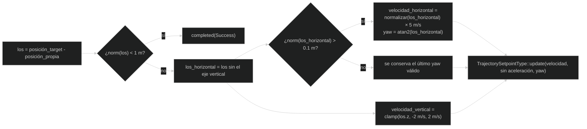
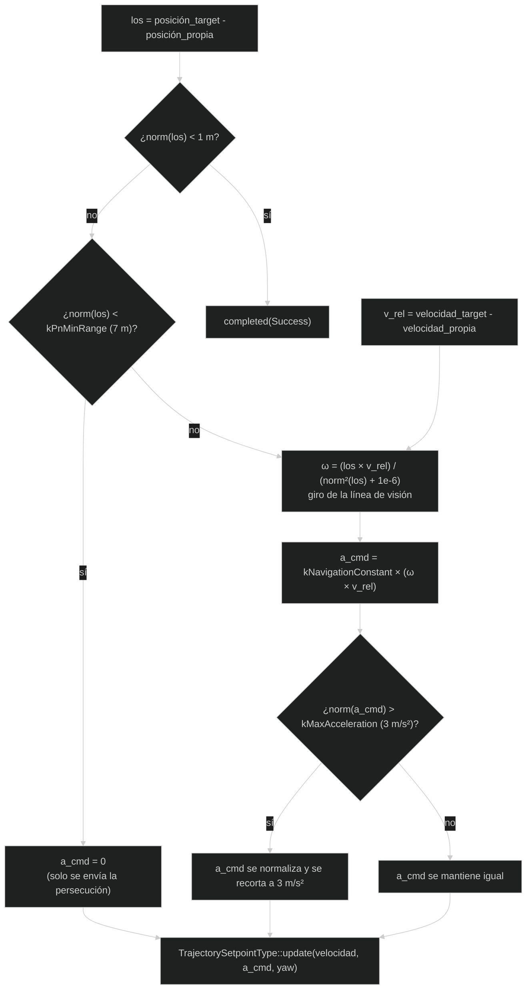

# Modos de guiado

Un **modo de guiado** es una estrategia que decide hacia dónde debe moverse el
interceptor. No mueve directamente los motores: calcula referencias y PX4 se
encarga del control de vuelo. Un **algoritmo** es simplemente una receta
ordenada de cálculos para obtener una decisión.

## Palabras de movimiento y matemáticas

| Término | Significado sencillo |
| --- | --- |
| **Posición** | Dónde está el vehículo, normalmente con tres números: este/oeste, norte/sur y altura. |
| **Velocidad** | Qué tan rápido y hacia dónde se mueve. |
| **Aceleración** | Cómo cambia la velocidad. |
| **Yaw** | Giro del vehículo alrededor del eje vertical; visto desde arriba, indica hacia dónde apunta el morro. |
| **Vector** | Grupo ordenado de números que representa una dirección y un tamaño. |
| **Norma** | Longitud o tamaño de un vector; aquí se usa para calcular una distancia. |
| **Normalizar** | Convertir un vector en uno de longitud 1 conservando su dirección. |
| **Velocidad relativa** | Velocidad del target comparada con la del interceptor: target menos interceptor. |
| **Línea de visión (LOS)** | Flecha imaginaria que va desde el interceptor hasta el target. |
| **Producto vectorial** | Operación entre vectores que ayuda a medir cómo cambia la dirección de una línea. |
| **Armar** | Dar permiso a PX4 para que el vehículo pueda activar sus motores/controladores. |
| **Cuaternión** | Cuatro números que representan una orientación sin algunos problemas de los ángulos tradicionales. |

Por ejemplo, si el interceptor está en `(0, 0, 0)` y el target en
`(10, 0, 0)`, la línea de visión apunta en la dirección positiva del primer
eje y su norma es `10`. No hace falta calcular a mano los productos: Eigen y
las funciones de la biblioteca realizan esas operaciones; lo importante es saber
qué representa cada resultado.

Los dos modos son clases C++ derivadas de `px4_ros2::ModeBase` y se envuelven
con `px4_ros2::NodeWithMode`. Esto permite que PX4 los conozca como modos de
vuelo personalizados.

## Ciclo común

Cada modo:

1. Crea un `TrajectorySetpointType` para enviar órdenes.
2. Lee la posición y velocidad propias con `OdometryLocalPosition`.
3. Busca `map -> target/base_link` cada 50 ms.
4. Rechaza el armado si aún no hay datos válidos del target.
5. Calcula un setpoint durante `updateSetpoint`.
6. Llama a `completed(Success)` cuando la distancia es menor que 1 m.

Si tf2 todavía no conoce el target, el modo muestra un aviso y no genera un
setpoint válido.

## Qué es un setpoint

Un setpoint no es una orden instantánea de “mueve el motor así”. Es una
referencia para el controlador de PX4. Este proyecto entrega principalmente
velocidad, yaw y, en PN, aceleración. PX4 combina esa referencia con sus
estimadores, límites y controladores internos.

Esto explica por qué cambiar una constante de velocidad no equivale a
teletransportar el dron: el autopiloto sigue aplicando su propia dinámica y
restricciones.

## `pursuit_mode`: persecución pura

Este modo apunta directamente hacia la posición actual del target:

- Velocidad horizontal máxima: `5 m/s`.
- Velocidad vertical limitada a `2 m/s`.
- El yaw se orienta hacia la línea de visión horizontal.
- No necesita `target/velocity`.

Es el algoritmo más sencillo para entender el flujo completo: posición del
target, diferencia con la posición propia y velocidad hacia el target.

### Ejemplo conceptual

Si el target está 10 m al este y 2 m por encima, el vector horizontal se
normaliza y se multiplica por `5 m/s`; la componente vertical se limita a
`2 m/s`. Si el target está casi exactamente encima, no se recalcula el yaw
horizontal y se conserva el último yaw válido.

### De la posición al setpoint, paso a paso

Este diagrama es literalmente el cuerpo de `updateSetpoint` en
`pursuit_mode.cpp`, sin código: cada caja es una línea o un pequeño grupo de
líneas, y cada flecha es el orden real en que se ejecutan.

## `PN_mode`: navegación proporcional

Este modo usa:

- La posición del target obtenida de tf2.
- La velocidad del target en `target/velocity`.
- La velocidad propia del interceptor.
- La velocidad relativa entre ambos.

Calcula la rotación de la línea de visión y genera una aceleración de navegación
proporcional. Sus límites actuales son:

| Constante | Valor | Significado |
| --- | ---: | --- |
| `kMaxHorizontalSpeed` | `7 m/s` | Velocidad horizontal máxima. |
| `kMaxVerticalSpeed` | `2 m/s` | Velocidad vertical máxima. |
| `kNavigationConstant` | `3.5` | Ganancia de navegación proporcional. |
| `kMaxAcceleration` | `3 m/s²` | Aceleración máxima solicitada. |
| `kPnMinRange` | `7 m` | Por debajo de esta distancia no aplica aceleración PN. |

PN no puede funcionar correctamente si `target_tf2_odometry` no publica
`target/velocity`. El modo también bloquea el armado hasta recibir posición y
velocidad.

### Cómo se calcula la aceleración PN

La velocidad horizontal/vertical de persecución (igual que en `pursuit_mode`,
pero con `7 m/s` en vez de `5 m/s`) siempre se calcula y se envía; `a_cmd` es
un extra que solo se activa por encima de `kPnMinRange`. Por eso PN nunca deja
de perseguir aunque la aceleración PN esté desactivada.

### Intuición de navegación proporcional

PN no intenta apuntar únicamente a la posición actual. Observa cómo gira la
línea que une interceptor y target. Si esa línea gira, existe riesgo de que el
target cruce por delante sin ser alcanzado; la aceleración PN intenta corregir
esa geometría. La ganancia `kNavigationConstant` hace la corrección más o menos
agresiva, pero no elimina los límites de seguridad.

## Comparación

| Característica | Pursuit | PN |
| --- | --- | --- |
| Posición del target | Sí | Sí |
| Velocidad del target | No | Sí |
| Aceleración calculada | No | Sí |
| Velocidad horizontal máxima | `5 m/s` | `7 m/s` |
| Complejidad | Menor | Mayor |

Las constantes están dentro de los archivos fuente; no hay parámetros externos
ni reconfiguración dinámica.

## Datos válidos y datos antiguos

Las banderas `_target_valid` y `_target_velocity_valid` solo indican que se ha
recibido al menos un dato. No comprueban por sí solas que el dato sea reciente,
que su timestamp sea correcto o que el target siga publicando. En una evolución
futura habría que añadir comprobaciones de antigüedad, calidad y timeout.

## Consejos para modificar un modo

1. Cambia una sola constante o fórmula cada vez.
2. Explica en un comentario la unidad física: metros, segundos o radianes.
3. Comprueba primero el vector `los` y después el setpoint.
4. Verifica que la conversión de frames no haya cambiado.
5. Prueba con distancias grandes, pequeñas, movimiento horizontal y vertical.
6. No pruebes directamente en hardware sin validar el comportamiento en SITL.

---

🏠 [Inicio](Home.md) · ⬅️ Anterior: [Nodos de odometría y diagnóstico](Nodes-and-topics.md) · ➡️ Siguiente: [Lectura guiada del código](Code-walkthrough.md)
