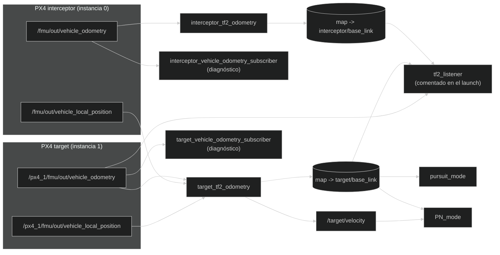

# Nodos, tópicos y diagnóstico

Esta página describe qué nodos y tópicos usa el paquete y cómo se conectan
entre sí; al final explica cómo inspeccionarlos para diagnosticar problemas.
Los comandos de esta página solo observan el sistema, nunca modifican el
código.

## Nodos principales

| Ejecutable | Responsabilidad |
| --- | --- |
| `interceptor_tf2_odometry` | Convierte la odometría de la instancia 0 y publica el frame del interceptor. |
| `target_tf2_odometry` | Convierte la odometría de la instancia 1, la desplaza al origen del interceptor (usando `vehicle_local_position` de las dos instancias) y publica el frame del target y `target/velocity`. |
| `pursuit_mode` | Modo de persecución pura basado en la posición. |
| `PN_mode` | Modo de navegación proporcional basado en posición y velocidad. |

Un **ejecutable** es un archivo que el sistema puede iniciar; un nodo es la
instancia ROS 2 que ese programa crea al arrancar. Normalmente hay una
relación uno a uno entre ambos, pero no son conceptos idénticos: el mismo
ejecutable podría iniciar varias instancias con nombres o namespaces
distintos. Una **instancia** es una copia concreta de un programa en
funcionamiento; un **namespace** es un prefijo de nombres que evita que dos
copias choquen entre sí.

## Nodos auxiliares

| Ejecutable | Uso |
| --- | --- |
| `vehicle_odometry_subscriber` | Imprime por pantalla la odometría recibida; el tópico y el nombre de vehículo de la cabecera dependen de los parámetros `vehicle_name`/`odometry_topic` (el launch lo arranca dos veces, con valores distintos para cada dron). |
| `tf2_listener` | Muestra la transformación relativa y la velocidad del target una vez por segundo. |

Los suscriptores de odometría son herramientas de inspección, no forman parte
del cálculo de control. `tf2_listener` está comentado en el launch por defecto.

## Grafo de nodos y tópicos



Los dos nodos de diagnóstico son el mismo ejecutable,
`vehicle_odometry_subscriber`, arrancado dos veces: el launch le da a cada uno
su nombre y el tópico que debe escuchar. Por eso en el diagrama cada uno cuelga
de la odometría del vehículo que le corresponde. Si lanzas uno a mano con
`ros2 run`, recuerda pasarle esos parámetros; si no, usará los valores por
defecto, que son los del interceptor.

## Tabla de entradas y salidas

| Nodo | Entrada | Salida |
| --- | --- | --- |
| `target_tf2_odometry` | `/px4_1/fmu/out/vehicle_odometry`, `/fmu/out/vehicle_local_position`, `/px4_1/fmu/out/vehicle_local_position` | `map -> target/base_link`, `target/velocity` |
| `interceptor_tf2_odometry` | `/fmu/out/vehicle_odometry` | `map -> interceptor/base_link` |
| `pursuit_mode` | tf2 target, odometría propia | setpoint de trayectoria |
| `PN_mode` | tf2 target, odometría propia, `target/velocity` | setpoint de trayectoria |
| suscriptores de diagnóstico | `VehicleOdometry` | texto en consola |
| `tf2_listener` | tf2 y odometría target | texto en consola |

La tabla es una vista de dependencias: si a un nodo le falta una entrada, el
problema suele estar en quien debería producir ese dato, no en el nodo mismo.

## Parámetros

Los modos declaran estos parámetros:

| Parámetro | Valor por defecto | Uso |
| --- | --- | --- |
| `target_frame` | `target/base_link` | Frame tf2 que representa al target. |
| `target_velocity_topic` | `target/velocity` | Tópico de velocidad usado por PN. |

Los conversores tf2 declaran `vehicle_name`, con valor `interceptor` o `target`
según el ejecutable. `vehicle_odometry_subscriber` declara los mismos dos
parámetros, `vehicle_name` (por defecto `interceptor`) y `odometry_topic` (por
defecto `/fmu/out/vehicle_odometry`); el launch se los fija a valores distintos
en cada una de sus dos instancias.

Los parámetros son configuración, no mensajes. Se consultan al crear el nodo y
permiten cambiar nombres sin modificar el binario. Para inspeccionarlos:

```bash
ros2 param list /pursuit_mode
ros2 param get /pursuit_mode target_frame
```

El nombre exacto del nodo depende de cómo lo registre `NodeWithMode` y de si se
usa un namespace.

## Inspección desde otra terminal

El launch (o cualquier nodo arrancado con `ros2 run`) ocupa su propia
terminal mostrando sus logs; para consultar el sistema mientras sigue
corriendo, abre una terminal nueva y carga primero ROS 2 y el workspace
(`source install/setup.bash`).

Comprobación rápida:

```bash
ros2 node list
ros2 topic list
ros2 topic echo /px4_1/fmu/out/vehicle_odometry
ros2 topic echo /target/velocity
ros2 topic hz /target/velocity
ros2 run tf2_tools view_frames
```

- `node list` y `topic list` muestran qué nodos y tópicos existen ahora
  mismo: si falta uno que esperabas, ese es el primer indicio de qué
  componente no ha arrancado.
- `topic echo` imprime en vivo los mensajes que pasan por un tópico —sirve
  para comprobar que hay datos de verdad, no solo que el tópico existe.
- `topic hz` mide la frecuencia real de publicación; compárala con la
  esperada (por ejemplo, unos 10 Hz para `target/velocity`).
- `view_frames` no imprime nada en la terminal: genera un archivo PDF en la
  carpeta actual con un dibujo de todo el árbol tf2, útil para ver de un
  vistazo qué frames existen y cómo se relacionan.

Para ir más allá de "existe o no existe":

```bash
ros2 node info /target_tf2_frame_publisher
ros2 topic info /target/velocity --verbose
ros2 interface show geometry_msgs/msg/TwistStamped
ros2 run tf2_ros tf2_echo map target/base_link
```

`node info` muestra las conexiones de un nodo concreto (qué publica y a qué
se suscribe); `topic info --verbose` muestra sus publishers, subscribers y
QoS; `interface show` enseña los campos que tiene un tipo de mensaje; y
`tf2_echo` imprime en tiempo real una transformación concreta del árbol tf2,
en vez de todo el árbol como `view_frames`.

Los nombres absolutos de los tópicos comienzan por `/`. En el código de los
modos, `target/velocity` se usa como nombre relativo y ROS 2 lo resuelve dentro
del namespace actual.

## Qué mirar primero si algo falla

1. ¿Aparecen los dos `VehicleOdometry` con `ros2 topic list`?
2. ¿Está el agente conectado en el puerto `8888`?
3. ¿Existen los dos frames publicados por `tf2`?
4. ¿Está `target/velocity` publicando datos?
5. ¿Se ha cargado `source install/setup.bash` en la terminal?

Anota siempre tres cosas al diagnosticar: el nombre exacto que aparece en
`ros2 topic list`, el tipo que devuelve `ros2 topic type` y la frecuencia de
`ros2 topic hz`. Los nombres parecidos pero no idénticos son una causa muy
frecuente de errores ROS 2.

---

🏠 [Inicio](Home.md) · ⬅️ Anterior: [Arquitectura y flujo de datos](Architecture.md) · ➡️ Siguiente: [Modos de guiado](Guidance-modes.md)
