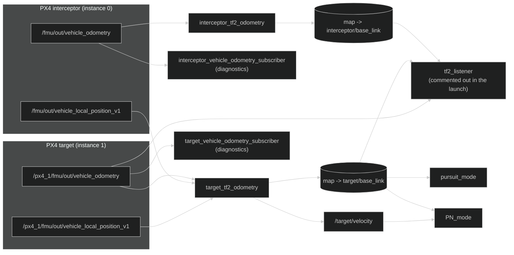

# Nodes, topics and diagnostics

This page describes which nodes and topics the package uses and how they
connect; at the end it explains how to inspect them to diagnose problems. The
commands on this page only observe the system, they never change the code.

## Main nodes

| Executable | Job |
| --- | --- |
| `interceptor_tf2_odometry` | Converts the odometry of instance 0 and publishes the interceptor frame. |
| `target_tf2_odometry` | Converts the odometry of instance 1, shifts it to the interceptor's origin (using `vehicle_local_position_v1` of both instances) and publishes the target frame and `target/velocity`. |
| `pursuit_mode` | Pure pursuit mode based on position. |
| `PN_mode` | Proportional navigation mode based on position and velocity. |

An **executable** is a file the system can start; a node is the ROS 2
instance that program creates when it starts. Usually there's a one-to-one
relation between them, but they're not the same concept: the same executable
could start several instances with different names or namespaces. An
**instance** is a specific running copy of a program; a **namespace** is a
name prefix that keeps two copies from clashing.

## Helper nodes

| Executable | Use |
| --- | --- |
| `vehicle_odometry_subscriber` | Prints the received odometry; the topic and the vehicle name in the header come from the `vehicle_name`/`odometry_topic` parameters (the launch starts it twice, with different values for each drone). |
| `tf2_listener` | Shows the relative transform and the target's velocity once per second. |

The odometry subscribers are inspection tools, not part of the control
calculation. `tf2_listener` is commented out in the launch by default.

## Node and topic graph



The two diagnostic nodes are the same executable,
`vehicle_odometry_subscriber`, started twice: the launch gives each one its
name and the topic it should listen to. That's why in the diagram each one
hangs off the odometry of its own vehicle. If you start one by hand with
`ros2 run`, remember to pass those parameters; otherwise it uses the defaults,
which are the interceptor's.

## Inputs and outputs

| Node | Input | Output |
| --- | --- | --- |
| `target_tf2_odometry` | `/px4_1/fmu/out/vehicle_odometry`, `/fmu/out/vehicle_local_position_v1`, `/px4_1/fmu/out/vehicle_local_position_v1` | `map -> target/base_link`, `target/velocity` |
| `interceptor_tf2_odometry` | `/fmu/out/vehicle_odometry` | `map -> interceptor/base_link` |
| `pursuit_mode` | target from tf2, own odometry | trajectory setpoint |
| `PN_mode` | target from tf2, own odometry, `target/velocity` | trajectory setpoint |
| diagnostic subscribers | `VehicleOdometry` | console text |
| `tf2_listener` | tf2 and target odometry | console text |

The table is a dependency view: if a node is missing an input, the problem is
usually in whoever should produce that data, not in the node itself.

### Why some topics end in `_v1` and others don't

Many PX4 messages carry a version number (`MESSAGE_VERSION`) that is part of
the topic name, as explained in
[Installation and build](Installation-and-build.md#px4). With the vendored
`px4_msgs`, `VehicleLocalPosition` is at version 1 and is published on
`/fmu/out/vehicle_local_position_v1`, while `VehicleOdometry` is at version 0
and is published without a suffix. That's why `target_tf2_odometry` doesn't
write the suffix by hand: it computes it with `px4_ros2::getMessageNameVersion`
from the message type, so it keeps working if that version changes. If you
copy a topic name from this page and `ros2 topic echo` shows nothing, first
check the exact name with `ros2 topic list | grep vehicle_local_position`.

## Parameters

The modes declare these parameters (`target_frame` both of them;
`target_velocity_topic` only PN):

| Parameter | Default | Use |
| --- | --- | --- |
| `target_frame` | `target/base_link` | tf2 frame that represents the target. |
| `target_velocity_topic` | `target/velocity` | Velocity topic; only declared by `PN_mode`, the only one that needs the velocity. |

The tf2 converters declare `vehicle_name`, set to `interceptor` or `target`
depending on the executable. `vehicle_odometry_subscriber` declares the same
two parameters, `vehicle_name` (default `interceptor`) and `odometry_topic`
(default `/fmu/out/vehicle_odometry`); the launch sets them to different
values for each of its two instances.

Parameters are configuration, not messages. They're read when the node is
created and let you change names without changing the binary. To inspect them:

```bash
ros2 param list /pursuit_mode
ros2 param get /pursuit_mode target_frame
```

The exact node name depends on how `NodeWithMode` registers it and on whether
a namespace is used.

## Inspecting from another terminal

The launch (or any node started with `ros2 run`) takes up its own terminal
showing its logs; to query the system while it keeps running, open a new
terminal and load ROS 2 and the workspace first (`source install/setup.bash`).

Quick check:

```bash
ros2 node list
ros2 topic list
ros2 topic echo /px4_1/fmu/out/vehicle_odometry
ros2 topic echo /target/velocity
ros2 topic hz /target/velocity
ros2 run tf2_tools view_frames
```

- `node list` and `topic list` show which nodes and topics exist right now:
  if one you expected is missing, that's the first hint of which component
  didn't start.
- `topic echo` prints the messages going through a topic live; it tells you
  there really is data, not just that the topic exists.
- `topic hz` measures the actual publishing rate; compare it with the expected
  one (for example, about 10 Hz for `target/velocity`).
- `view_frames` prints nothing in the terminal: it writes a PDF in the current
  folder with a drawing of the whole tf2 tree, handy to see at a glance which
  frames exist and how they relate.

To go beyond "exists or not":

```bash
ros2 node info /target_tf2_frame_publisher
ros2 topic info /target/velocity --verbose
ros2 interface show geometry_msgs/msg/TwistStamped
ros2 run tf2_ros tf2_echo map target/base_link
```

`node info` shows a specific node's connections (what it publishes and what it
subscribes to); `topic info --verbose` shows a topic's publishers, subscribers
and QoS; `interface show` shows the fields of a message type; and `tf2_echo`
prints one specific transform of the tf2 tree in real time, instead of the
whole tree like `view_frames`.

Absolute topic names start with `/`. In the mode code, `target/velocity` is
used as a relative name and ROS 2 resolves it inside the current namespace.

## What to check first if something fails

1. Do both `VehicleOdometry` topics show up in `ros2 topic list`?
2. Is the agent connected on port `8888`?
3. Do both frames published through tf2 exist?
4. Is `target/velocity` publishing data?
5. Has `source install/setup.bash` been run in that terminal?

When diagnosing, always note three things: the exact name shown by
`ros2 topic list`, the type returned by `ros2 topic type` and the rate from
`ros2 topic hz`. Names that look alike but aren't identical are a very common
cause of ROS 2 errors.

---

🏠 [Home](Home.md) · ⬅️ Previous: [Architecture and data flow](Architecture.md) · ➡️ Next: [Guidance modes](Guidance-modes.md)
