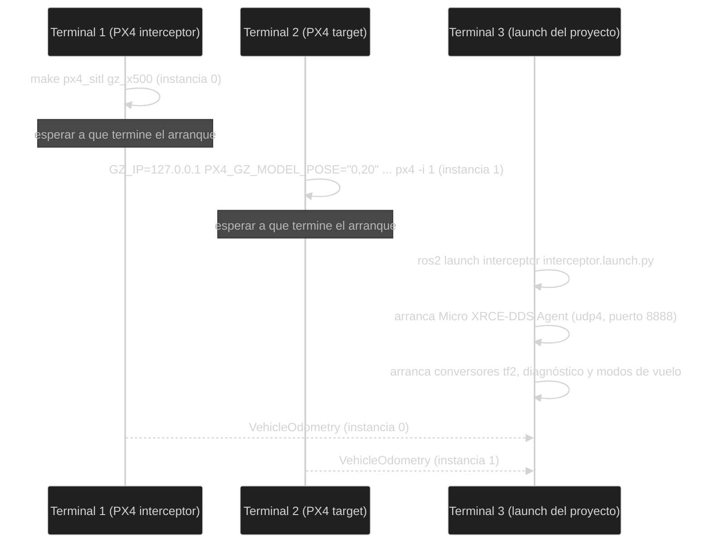

# Ejecución de la simulación

Esta página describe cómo poner varias piezas a funcionar al mismo tiempo.
Cuando se dice “otra terminal”, se trata de otra ventana de comandos; cada una
mantiene su propio proceso activo.

El launch del proyecto conecta ROS 2 con dos instancias PX4 SITL. PX4 SITL
simula el autopiloto y el vehículo; el Micro XRCE-DDS Agent hace de puente
entre PX4 y ROS 2.

## Qué se está simulando

SITL no es solo una ventana con un modelo 3D. Ejecuta el software de PX4 y sus
estimadores como procesos normales, de forma que ROS 2 recibe mensajes muy
parecidos a los de un vehículo real. Esto permite probar la integración sin
arriesgar hardware, aunque no reproduce todas las condiciones físicas.

Las instancias deben tener identidades diferentes:

- índice `0`: interceptor, tópicos sin `/px4_1/`;
- índice `1`: target, tópicos con `/px4_1/`.

`/px4_1/` es un prefijo que PX4 añade automáticamente a los tópicos de una
instancia arrancada con `-i` mayor que 0 (aquí, `-i 1`), para distinguirlos
de los de la instancia `0`, que no lleva prefijo. Aquí hace falta porque
interceptor y target son dos PX4 corriendo a la vez en el mismo ordenador:
sin el prefijo, ambos publicarían en los mismos nombres de tópico y no habría
forma de saber de qué vehículo viene cada mensaje. Por eso el índice no es un
nombre visual, sino parte real del direccionamiento: si se intercambian los
índices al arrancar, el código sigue compilando igual, pero cada nodo termina
consumiendo los datos del vehículo equivocado.

## Orden recomendado

Abre terminales separadas y carga ROS 2 y el workspace cuando corresponda.



El orden importa: si el launch arranca antes que las dos instancias PX4, sus
nodos simplemente no reciben odometría todavía y esperan; si el agente DDS no
está corriendo, ninguna de las dos instancias PX4 llega a ROS 2 aunque estén
"arrancadas".

### 1. Iniciar PX4 del interceptor

En el directorio de PX4:

```bash
cd ~/PX4-Autopilot
make px4_sitl gz_x500
```

Esta es la instancia `0` (el interceptor, ver arriba).

Espera a que PX4 termine su arranque antes de continuar. En una prueba real
conviene confirmar que el proceso está estable y que el vehículo aparece en la
herramienta de simulación.

### 2. Iniciar PX4 del target

En otra terminal:

```bash
cd ~/PX4-Autopilot
GZ_IP=127.0.0.1 PX4_GZ_MODEL_POSE="0,20" PX4_SIM_MODEL=gz_x500 ./build/px4_sitl_default/bin/px4 -i 1
```

Esta es la instancia `1` (el target, ver arriba). Aquí no se usa `make`: el
simulador ya lo arrancó la instancia `0`, así que se ejecuta directamente el
binario de PX4 que compiló el paso anterior. Cada parte de la orden importa:

- `./build/...`: la ruta es relativa a `~/PX4-Autopilot` (empieza por `./`). Con
  `/build/...` el sistema la buscaría desde la raíz del disco y no la encontraría.
- `GZ_IP=127.0.0.1`: dirección por la que PX4 habla con Gazebo. `make` la fija
  sola para la instancia `0`; si la instancia `1` no usa la misma, Gazebo crea
  el dron pero PX4 no recibe sus sensores (`Accel Sensor 0 missing`,
  `ekf2 missing data`) y no publica odometría.
- `PX4_GZ_MODEL_POSE="0,20"`: posición inicial del target en Gazebo, en metros
  (`x,y`): aquí, 20 m al norte del interceptor. Sin ella, el target aparece en
  el mismo punto que el interceptor, uno dentro del otro.
- `PX4_SIM_MODEL=gz_x500`: el mismo modelo de dron que la instancia `0`.
- `-i 1`: el número de instancia, que da el prefijo `/px4_1/` a sus tópicos.

### 3. Iniciar el launch del proyecto

```bash
source /opt/ros/jazzy/setup.bash
source install/setup.bash
ros2 launch interceptor interceptor.launch.py
```

El launch inicia el agente con `udp4` en el puerto `8888`, los conversores de
odometría, los nodos de diagnóstico y los dos nodos de modo de vuelo. `udp4`
significa comunicación UDP usando IPv4: una forma de enviar paquetes por la
red sin mantener una conexión permanente; aquí se usa dentro del propio
ordenador, para que el agente reciba los datos que le manda PX4.

El launch no inicia PX4 SITL. Los dos comandos anteriores son obligatorios si
se quiere probar con simulación.

### 4. Abrir QGroundControl

Abre QGroundControl v5.1.4 (ver [Instalación y compilación](Installation-and-build.md)).
Se conecta solo a las dos instancias por UDP (puerto `14550`), sin configurar
nada: el interceptor aparece como vehículo `1` y el target como vehículo `2`.
Mientras QGroundControl no esté abierto, PX4 no deja armar
(`Preflight Fail: No connection to the GCS`).

## Cómo saber si el arranque funcionó

En una terminal nueva, después de hacer `source install/setup.bash`:

```bash
ros2 node list
ros2 topic list | grep -E 'vehicle_odometry|target/velocity'
ros2 topic hz /target/velocity
```

Deberías ver los nodos del paquete, los tópicos de odometría de las dos
instancias y una frecuencia aproximada de 10 Hz para `target/velocity`. La
frecuencia exacta puede variar; lo importante al principio es que existan datos
que cambien.

## Probar el guiado

### Poner a los dos drones en el mismo origen

Cada PX4 mide su posición local desde el punto donde arrancó (su *origen*).
Como el target arranca 20 m al norte, su origen está 20 m al norte del del
interceptor, y los modos de guiado comparan posiciones medidas desde orígenes
distintos: el target les parece estar donde está el interceptor y dan el
objetivo por alcanzado sin moverse. Hasta que eso se corrija en el código, hay
que darle al target el mismo origen que al interceptor.

En la terminal 1 (la consola `pxh>` del interceptor), lee su origen:

```text
listener vehicle_local_position
```

Apunta `ref_lat`, `ref_lon` y `ref_alt`. En la terminal 2 (la consola `pxh>`
del target), aplica esos valores:

```text
commander set_ekf_origin <ref_lat> <ref_lon> <ref_alt>
```

Si responde `commander not running`, espera unos segundos y repítelo. Para
comprobarlo, `ros2 run tf2_ros tf2_echo map target/base_link` debe situar al
target a unos 20 m (`y` ≈ 20), no en `0`. Hay que repetir este paso cada vez
que se arranquen las instancias.

### Volar

En QGroundControl, eligiendo cada vehículo en el selector de vehículo de la
barra superior:

1. **Target (vehículo 2)**: despega (*Takeoff*). Cuando esté en el aire, pulsa
   en el mapa y usa *Go to location* para mandarlo a otro punto; así la
   persecución es contra un objetivo en movimiento.
2. **Interceptor (vehículo 1)**: despega (*Takeoff*) y, ya en el aire, elige
   en el selector de modo de vuelo **PN mode** o **Pursuit Intercept**.

El interceptor sale a por el target. El modo solo se deja seleccionar cuando
recibe datos del target; si no, PX4 lo rechaza con
`No target odometry received yet` (ver
[Solución de problemas](Quick-reference-and-troubleshooting.md)). Al alcanzarlo
(a menos de 1 m) el log muestra `Target reached. Stopping pursuit.`, pero el
interceptor sigue en el modo: si el target se aleja, vuelve a perseguirlo.
Para terminar, cambia el interceptor a *Hold* o *Land*.

## Ejecutar un nodo individual

```bash
ros2 run interceptor pursuit_mode
ros2 run interceptor PN_mode
ros2 run interceptor target_tf2_odometry
```

No ejecutes dos copias del mismo nodo sin una razón clara: podrían publicar el
mismo transform o consumir recursos duplicados.

Para detener una prueba, detén primero el launch y después las instancias PX4.
Si dejas procesos antiguos activos, la siguiente prueba puede recibir mensajes
duplicados o fallar al abrir puertos.

## Nota sobre los modos

El launch actual inicia tanto `pursuit_mode` como `PN_mode`. Ambos se registran
como modos personalizados de PX4 mediante `px4_ros2_cpp`. Para entender sus
diferencias y sus datos necesarios, consulta [Modos de guiado](Guidance-modes.md).

---

🏠 [Inicio](Home.md) · ⬅️ Anterior: [Instalación y compilación](Installation-and-build.md) · ➡️ Siguiente: [Arquitectura y flujo de datos](Architecture.md)
