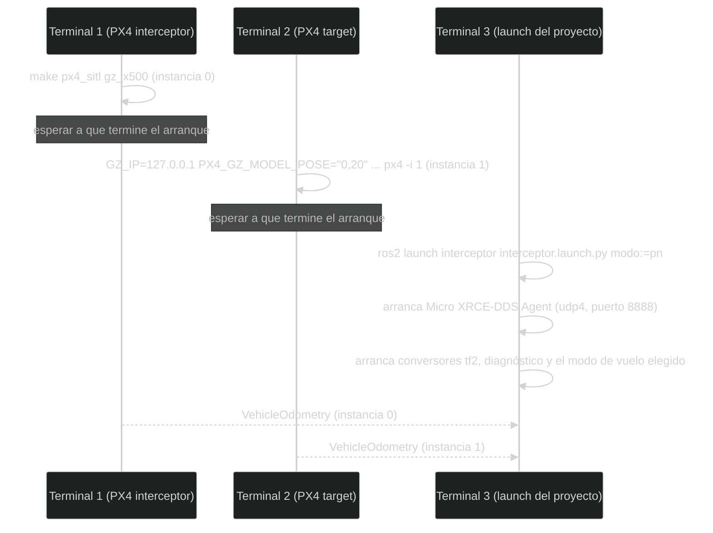

# Ejecución de la simulación

Esta página describe cómo poner varias piezas a funcionar al mismo tiempo.
Cuando se dice “otra terminal”, se trata de otra ventana de comandos; cada una
mantiene su propio proceso activo.

El launch del proyecto conecta ROS 2 con dos instancias PX4 SITL. PX4 SITL
simula el autopiloto y el vehículo; el Micro XRCE-DDS Agent hace de puente
entre PX4 y ROS 2.

## Antes de empezar

Esta página da por hecho que ya has seguido
[Instalación y compilación](Installation-and-build.md) y que tienes:

- el workspace **compilado** (`colcon build --symlink-install` sin errores);
- **PX4** clonado en `~/PX4-Autopilot`, fijado en el commit que indica esa
  página y compilado al menos una vez (si lo clonaste en otro sitio, cambia esa
  ruta en los comandos de los pasos 1 y 2);
- el **Micro XRCE-DDS Agent** compilado en `~/Micro-XRCE-DDS-Agent`;
- **QGroundControl v5.1.4** descargado.

Necesitarás cuatro terminales: una por cada pieza que se queda ejecutándose,
más alguna suelta para comprobar cosas.

<a id="cargar-el-entorno"></a>
**Cargar el entorno.** Cada terminal nueva empieza sin saber nada de ROS 2 ni
de este workspace, y lo que se carga en una no vale para las demás. Antes de
usar cualquier comando `ros2`, en esa terminal:

```bash
cd ~/ws_interceptor          # la ruta donde clonaste el workspace
source /opt/ros/jazzy/setup.bash
source install/setup.bash
```

La primera línea carga ROS 2 y la segunda, este workspace (por eso hay que
estar dentro de su carpeta: `install/setup.bash` es una ruta relativa). Las
terminales de PX4 no lo necesitan: PX4 no es un programa de ROS 2.

## Resumen rápido

Los comandos, en orden, para tenerlo todo en marcha. Cada bloque va en su
propia terminal y se explica en detalle más abajo.

```bash
# 1. Interceptor (instancia 0). Abre también la ventana de Gazebo
cd ~/PX4-Autopilot
make px4_sitl gz_x500

# 2. Target (instancia 1), 20 m al norte
cd ~/PX4-Autopilot
GZ_IP=127.0.0.1 PX4_GZ_MODEL_POSE="0,20" PX4_SIM_MODEL=gz_x500 ./build/px4_sitl_default/bin/px4 -i 1

# 3. Nodos del proyecto, con el modo de guiado elegido
cd ~/ws_interceptor          # la ruta donde clonaste el workspace
source /opt/ros/jazzy/setup.bash
source install/setup.bash
ros2 launch interceptor interceptor.launch.py modo:=pn

# 4. Estación de tierra
~/QGroundControl-x86_64.AppImage
```

Después, desde QGroundControl: despega los dos drones, manda el target a otro
punto y elige **PN mode** en el interceptor (ver [Volar](#volar)).

## Qué se está simulando

SITL no es solo una ventana con un modelo 3D. Ejecuta el software de PX4 y sus
estimadores como procesos normales, de forma que ROS 2 recibe mensajes muy
parecidos a los de un vehículo real. Esto permite probar la integración sin
arriesgar hardware, aunque no reproduce todas las condiciones físicas.

Las instancias deben tener identidades diferentes:

- índice `0`: interceptor, tópicos sin `/px4_1/`;
- índice `1`: target, tópicos con `/px4_1/`.

`/px4_1/` es un prefijo que PX4 añade automáticamente a los tópicos de una
instancia arrancada con `-i` mayor que 0 (aquí, `-i 1`), para distinguirlos
de los de la instancia `0`, que no lleva prefijo. Aquí hace falta porque
interceptor y target son dos PX4 corriendo a la vez en el mismo ordenador:
sin el prefijo, ambos publicarían en los mismos nombres de tópico y no habría
forma de saber de qué vehículo viene cada mensaje. Por eso el índice no es un
nombre visual, sino parte real del direccionamiento: si se intercambian los
índices al arrancar, el código sigue compilando igual, pero cada nodo termina
consumiendo los datos del vehículo equivocado.

## Orden recomendado

Abre terminales separadas y carga ROS 2 y el workspace cuando corresponda.



El orden importa: si el launch arranca antes que las dos instancias PX4, sus
nodos simplemente no reciben odometría todavía y esperan; si el agente DDS no
está corriendo, ninguna de las dos instancias PX4 llega a ROS 2 aunque estén
"arrancadas".

### 1. Iniciar PX4 del interceptor

En el directorio de PX4:

```bash
cd ~/PX4-Autopilot
make px4_sitl gz_x500
```

Esta es la instancia `0` (el interceptor, ver arriba).

Espera a que PX4 termine su arranque antes de continuar. En una prueba real
conviene confirmar que el proceso está estable y que el vehículo aparece en la
herramienta de simulación.

### 2. Iniciar PX4 del target

En otra terminal:

```bash
cd ~/PX4-Autopilot
GZ_IP=127.0.0.1 PX4_GZ_MODEL_POSE="0,20" PX4_SIM_MODEL=gz_x500 ./build/px4_sitl_default/bin/px4 -i 1
```

Esta es la instancia `1` (el target, ver arriba). Aquí no se usa `make`: el
simulador ya lo arrancó la instancia `0`, así que se ejecuta directamente el
binario de PX4 que compiló el paso anterior. Cada parte de la orden importa:

- `./build/...`: la ruta es relativa a `~/PX4-Autopilot` (empieza por `./`). Con
  `/build/...` el sistema la buscaría desde la raíz del disco y no la encontraría.
- `GZ_IP=127.0.0.1`: dirección por la que PX4 habla con Gazebo. `make` la fija
  sola para la instancia `0`; si la instancia `1` no usa la misma, Gazebo crea
  el dron pero PX4 no recibe sus sensores (`Accel Sensor 0 missing`,
  `ekf2 missing data`) y no publica odometría.
- `PX4_GZ_MODEL_POSE="0,20"`: posición inicial del target en Gazebo, en metros
  (`x,y`): aquí, 20 m al norte del interceptor. Sin ella, el target aparece en
  el mismo punto que el interceptor, uno dentro del otro.
- `PX4_SIM_MODEL=gz_x500`: el mismo modelo de dron que la instancia `0`.
- `-i 1`: el número de instancia, que da el prefijo `/px4_1/` a sus tópicos.

### 3. Iniciar el launch del proyecto

En otra terminal, **dentro de la carpeta del workspace** (los dos pasos
anteriores te dejaron en la de PX4, y una terminal nueva empieza en tu carpeta
personal). Es lo que explica [Cargar el entorno](#cargar-el-entorno):

```bash
cd ~/ws_interceptor          # la ruta donde clonaste el workspace
source /opt/ros/jazzy/setup.bash
source install/setup.bash
ros2 launch interceptor interceptor.launch.py modo:=pn
```

Si lanzas esos `source` desde otra carpeta, verás
`bash: install/setup.bash: No such file or directory` y después
`Package 'interceptor' not found`: son la misma causa, no estás en el workspace.

El argumento `modo` es opcional y solo acepta `pn` o `pursuit`; si se omite,
vale `pn`. El launch
inicia el agente con `udp4` en el puerto `8888`, los conversores de
odometría, los nodos de diagnóstico y el único nodo de modo de vuelo elegido
con `modo`. `udp4` significa comunicación UDP usando IPv4: una forma de enviar
paquetes por la red sin mantener una conexión permanente; aquí se usa dentro
del propio ordenador, para que el agente reciba los datos que le manda PX4.

El launch no inicia PX4 SITL. Los dos comandos anteriores son obligatorios si
se quiere probar con simulación.

### 4. Abrir QGroundControl

En otra terminal, ejecuta el AppImage que descargaste en
[Instalación y compilación](Installation-and-build.md), con la ruta donde lo
guardaste:

```bash
~/QGroundControl-x86_64.AppImage
```

También puedes abrirlo con doble clic desde el explorador de archivos, si le
diste permiso de ejecución. La primera vez pregunta por el tipo de vehículo y
las unidades: elige *PX4 Pro*, *Multi-Rotor* y *Metric System*, para que las
distancias coincidan con las de esta wiki.

Se conecta solo a las dos instancias por UDP (puerto `14550`), sin configurar
nada: el interceptor aparece como vehículo `1` y el target como vehículo `2`.
Mientras QGroundControl no esté abierto, PX4 no deja armar
(`Preflight Fail: No connection to the GCS`).

## Cómo saber si el arranque funcionó

En una terminal nueva, con el entorno cargado (ver
[Cargar el entorno](#cargar-el-entorno)):

```bash
ros2 node list
ros2 topic list | grep -E 'vehicle_odometry|target/velocity'
ros2 topic hz /target/velocity
```

Deberías ver los nodos del paquete, los tópicos de odometría de las dos
instancias y una frecuencia aproximada de 10 Hz para `target/velocity`. La
frecuencia exacta puede variar; lo importante al principio es que existan datos
que cambien.

## Probar el guiado

No hay que preparar nada más. Cada PX4 mide su posición desde el punto donde
arrancó, así que el interceptor y el target usan orígenes distintos, pero
`target_tf2_odometry` lo corrige solo: coloca al target en el mismo marco que
el interceptor antes de publicarlo (ver
[Arquitectura y flujo de datos](Architecture.md)). Puedes confirmarlo en una
terminal nueva, con el entorno cargado (ver
[Cargar el entorno](#cargar-el-entorno)):

```bash
ros2 run tf2_ros tf2_echo map target/base_link
```

Con el target arrancado 20 m al norte, debe salir `y` ≈ 20, no `0`.

### Volar

En QGroundControl, eligiendo cada vehículo en el selector de vehículo de la
barra superior:

1. **Target (vehículo 2)**: despega (*Takeoff*). Cuando esté en el aire, pulsa
   en el mapa y usa *Go to location* para mandarlo a otro punto; así la
   persecución es contra un objetivo en movimiento.
2. **Interceptor (vehículo 1)**: despega (*Takeoff*) y, ya en el aire, elige
   en el selector de modo de vuelo **PN mode** o **Pursuit Intercept**.

El interceptor sale a por el target. El modo solo se deja seleccionar cuando
recibe datos del target; si no, PX4 lo rechaza con
`No target odometry received yet` (ver
[Solución de problemas](Quick-reference-and-troubleshooting.md)). Al alcanzarlo
(a menos de 1 m) el log muestra `Target reached. Stopping pursuit.` una vez por
cada acercamiento, pero el interceptor sigue en el modo: si el target se aleja,
vuelve a perseguirlo y el aviso saldrá de nuevo en el siguiente alcance.
Para terminar, cambia el interceptor a *Hold* o *Land*.

## Ejecutar un nodo individual

Cada nodo va en su propia terminal, con el entorno cargado (ver
[Cargar el entorno](#cargar-el-entorno)). Sirve para probar una pieza suelta
sin levantar todo el launch; PX4 tiene que estar corriendo igualmente.

```bash
ros2 run interceptor target_tf2_odometry
ros2 run interceptor interceptor_tf2_odometry
ros2 run interceptor tf2_listener
```

El nodo de diagnóstico de odometría es un único ejecutable que sirve para los
dos drones, así que a mano hay que decirle a cuál escuchar:

```bash
ros2 run interceptor vehicle_odometry_subscriber --ros-args \
  -p vehicle_name:=target -p odometry_topic:=/px4_1/fmu/out/vehicle_odometry
```

Sin esos parámetros usa los valores por defecto, que son los del interceptor.

No ejecutes dos copias del mismo nodo sin una razón clara: podrían publicar el
mismo transform o consumir recursos duplicados. Y no lances un modo de guiado
(`pursuit_mode` o `PN_mode`) mientras el launch tiene otro en marcha: los dos
intentarían registrarse en PX4 y puede quedar un registro duplicado que no
responde (ver "Nota sobre los modos", más abajo).

## Parar la simulación

Detén primero el launch y después las instancias PX4, cada una con Ctrl-C en su
terminal. Si dejas procesos antiguos activos, la siguiente prueba puede recibir
mensajes duplicados o fallar al abrir puertos.

Al pulsar Ctrl-C, el launch tarda unos **5 segundos** en cerrarse. Es a
propósito: el modo de vuelo necesita ese margen para darse de baja en PX4 antes
de que se cierre el agente, que es quien lleva ese aviso. El agente ignora el
primer Ctrl-C y se cierra cuando el launch insiste, cinco segundos después. Si
se cerrara a la vez que el resto, PX4 se quedaría con un modo registrado que ya
no existe, y al relanzar aparecerían avisos de modos sin respuesta.

La ventana de Gazebo la arrancó la instancia `0`, así que se cierra al parar
esa terminal; si se queda abierta, ciérrala tú. QGroundControl es un programa
aparte: ciérralo desde su ventana cuando ya no lo necesites. Para comprobar que
no queda nada colgado:

```bash
pgrep -a -f 'px4|gz sim|MicroXRCEAgent'
```

Si sigue apareciendo algo después de cerrar todas las terminales, ciérralo con
`pkill -f` y el nombre que aparezca antes de volver a empezar.

## Nota sobre los modos

El launch registra en PX4 **un solo** modo de guiado, el que elijas con
`modo:=pn` o `modo:=pursuit`. Los dos se registran mediante `px4_ros2_cpp`,
pero de uno en uno: si ambos intentan registrarse a la vez, PX4 puede quedarse
con un registro duplicado que no responde y ese modo deja de poder activarse.
Para probar el otro, detén el launch y vuelve a lanzarlo con el otro valor.
Para entender sus diferencias y sus datos necesarios, consulta
[Modos de guiado](Guidance-modes.md).

---

🏠 [Inicio](Home.md) · ⬅️ Anterior: [Instalación y compilación](Installation-and-build.md) · ➡️ Siguiente: [Arquitectura y flujo de datos](Architecture.md)
