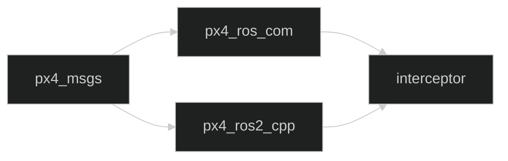

# Workspace map and dependencies

This page covers **every file in `src/` and `.github/`**. The current
inventory has 590 files:

| Area | Files | Purpose |
| --- | ---: | --- |
| `src/interceptor` | 12 | The project's own code. |
| `src/px4_msgs` | 289 | ROS 2 definitions matching PX4 messages, services and actions. |
| `src/px4_ros_com` | 28 | Examples and utilities for communication between ROS 2 and PX4. |
| `src/px4-ros2-interface-lib` | 258 | Vendored library to register PX4 modes and send setpoints. |
| `.github/workflows` | 3 | CI, issue summaries and releases. |

## How to use this map

There's no need to open the 590 files in order: the number says how many files
there are, not a reading sequence. Start with `src/interceptor`, because it's
this project's code, and then look only at the dependency you need to
understand. When you see a folder, think of it as a box with a purpose; when
you see a file, ask whether it holds instructions, data, configuration or
documentation. That classification is more useful than memorising names, and
it fits the five main kinds of file in the inventory:

1. **Our code**: `src/interceptor`.
2. **Vendored dependencies**: the other three packages inside `src/`.
3. **Interfaces**: `.msg` and `.srv` files that describe data structures.
4. **Configuration and build**: `CMakeLists.txt`, `package.xml`, YAML, JSON,
   repository lists and format files.
5. **Automation and documentation**: workflows, READMEs, scripts and
   contribution documents.

A vendored dependency should not be changed to fix the interceptor's
behaviour. First understand which interface it offers and change only
`src/interceptor`, unless the goal is to update that dependency.

## `src/interceptor`: our 12 files

| File | What it does |
| --- | --- |
| [`CMakeLists.txt`](../../src/interceptor/CMakeLists.txt) | Declares dependencies, builds the six executables and installs binaries and launch files. |
| [`package.xml`](../../src/interceptor/package.xml) | Declares the package name, version, licence and ROS 2 dependencies. |
| [`README.md`](../../src/interceptor/README.md) | Short installation guide and official links. |
| [`LICENSE`](../../src/interceptor/LICENSE) | Legal terms of our package. |
| [`.gitignore`](../../src/interceptor/.gitignore) | Keeps local build artefacts of the package out of git. |
| [`launch/interceptor.launch.py`](../../src/interceptor/launch/interceptor.launch.py) | Starts the DDS agent, converters and diagnostics, and a single mode chosen with `mode:=pn\|pursuit`. |
| [`src/interceptor_tf2_odometry.cpp`](../../src/interceptor/src/interceptor_tf2_odometry.cpp) | Converts PX4 odometry and publishes the interceptor frame. |
| [`src/target_tf2_odometry.cpp`](../../src/interceptor/src/target_tf2_odometry.cpp) | Publishes the target frame (shifted to the interceptor's origin) and its ENU velocity. |
| [`src/pursuit_mode.cpp`](../../src/interceptor/src/pursuit_mode.cpp) | Pure pursuit mode based on position. |
| [`src/PN_mode.cpp`](../../src/interceptor/src/PN_mode.cpp) | Proportional navigation mode based on position and velocity. |
| [`src/tf2_listener.cpp`](../../src/interceptor/src/tf2_listener.cpp) | Tool that prints relative transforms. |
| [`src/vehicle_odometry_subscriber.cpp`](../../src/interceptor/src/vehicle_odometry_subscriber.cpp) | Prints a vehicle's odometry for diagnostics; the launch starts it twice with different `vehicle_name`/`odometry_topic` parameters. |

The overall reading guide for these files is the
[Code walkthrough](Code-walkthrough.md), and the "Line by line" pages go
through them in detail.

## `src/px4_msgs`: PX4 messages and services

This package doesn't implement flight control. It defines the types that let
ROS 2 exchange data with PX4.

| Area | Current files | Explanation |
| --- | ---: | --- |
| `msg/*.msg` | 261 | Each file describes the fields and types of a PX4 uORB message. |
| `srv/VehicleCommand.srv` | 1 | Describes a request/response for vehicle commands. |
| `CMakeLists.txt` | 1 | Generates ROS 2 code from the `.msg` and `.srv` files. |
| `package.xml` | 1 | Declares the interface generators and runtime. |
| `README.md` | 1 | Documents the official package and its use. |
| `CHANGELOG.rst` | 1 | Change history. |
| `CONTRIBUTING.md` | 1 | Rules for contributing to the external package. |
| `QUALITY_DECLARATION.md` | 1 | The package's quality declaration. |
| `CODE_OF_CONDUCT.md` | 1 | Code of conduct. |
| `SECURITY.md` | 1 | Vulnerability reporting process. |
| `LICENSE` | 1 | BSD-3-Clause licence. |
| `.github/` | 10 | Upstream templates, Dependabot configuration and workflows. |
| `container/` | 2 | Dockerfile and scripts to build Debian packages. |
| `scripts/` | 3 | Changelog, release and build automation. |
| `.gitignore`, `.dockerignore`, `.pre-commit-config.yaml` | 3 | Exclusions and development tools. |

### How to read a `.msg`

A `.msg` holds lines like `float32 x` or `uint64 timestamp`. It isn't a
hand-written C++ class: the ROS 2 generator turns that description into
programming types. That's why the interceptor can write
`px4_msgs::msg::VehicleOdometry` and access `position`, `velocity` or `q`.

The 261 messages are grouped by PX4 capability: odometry, sensors, actuators,
navigation, status, setpoints and commands. Each file describes a data
contract; changing it can break compatibility with the PX4 version that
publishes those fields.

## `src/px4_ros_com`: ROS 2/PX4 bridge and examples

| Area | Current files | Explanation |
| --- | ---: | --- |
| `CMakeLists.txt` and `package.xml` | 2 | Build the package and declare Eigen, ROS 2 and `px4_msgs`. |
| `include/px4_ros_com/` | 1 header | Declares the frame conversions used by the interceptor. |
| `src/lib/frame_transforms.cpp` | 1 | Implements the NED/ENU conversions and the PX4/ROS orientations. |
| `src/examples/` | 5 | C++ examples of listeners, advertisers and offboard control. |
| `src/examples/offboard_py/` | 1 | Python offboard control example. |
| `px4_ros_com/` (Python package) | 2 | `__init__.py` and `module_to_import.py`, both empty: the Python skeleton installed by `ament_python_install_package` in `CMakeLists.txt`, not really used by the current examples. |
| `launch/` | 2 | Launch files for the communication examples (YAML and Python). |
| `test/` | 4 | Python tests of the external package. |
| `scripts/` | 4 | Install and build scripts. |
| `README.md`, `LICENSE` | 2 | Documentation and licence. |
| `.github/`, `.vscode/`, `.gitignore` | 4 | CI, editor settings and exclusions. |

The file our code uses directly is `include/px4_ros_com/frame_transforms.h`.
Its functions save us from repeating by hand the sign and axis changes between
NED and ENU.

## `src/px4-ros2-interface-lib`: PX4 modes library

This dependency provides `px4_ros2::ModeBase`, `px4_ros2::NodeWithMode`,
`OdometryLocalPosition` and `TrajectorySetpointType`.

| Area | Current files | Explanation |
| --- | ---: | --- |
| `px4_ros2_cpp/` | 146 | C++ library: public headers, implementation, components, odometry, navigation, setpoints and tests. Includes its own `CMakeLists.txt`, `package.xml` and `rosdep-*.yaml` per ROS distribution. |
| `px4_ros2_py/` | 17 | Experimental Python bindings and package, with its own `CMakeLists.txt` and `package.xml`. |
| `examples/cpp/` | 54 | C++ modes and examples: goto, mission, rover, VTOL, manual and navigation; each example has its own `CMakeLists.txt` and `package.xml`. |
| `examples/python/` | 12 | Python mode examples, each with its own `package.xml`. |
| `mission/` | 2 | A mission schema (`schema.yaml`) and an example (`pickup.json`). |
| `python_docs/` | 5 | Python documentation settings and pages (Sphinx). |
| `scripts/` | 5 | Compatibility check, topics, clang-tidy and Doxygen. |
| `.github/` | 6 | CI, lint, Debian package publishing, release branch and mission validation workflows. |
| `.clang-format`, `.clang-format-ignore`, `.clang-tidy`, `.pre-commit-config.yaml`, `.vscode/` | 5 | Formatting, static analysis, hooks and editor. |
| `README.md`, `LICENSE`, `Doxyfile`, `.gitignore`, `dependencies.repos`, `ruff.toml` | 6 | Documentation, licence, API generation, exclusions, external dependencies and settings for the Python linter `ruff`. |

### What happens when we use this library

`pursuit_mode.cpp` doesn't publish a low-level PX4 message directly. It
inherits from `ModeBase`, creates a `TrajectorySetpointType` and lets the
library:

1. register the mode with PX4;
2. check message compatibility;
3. manage the mode's state;
4. translate velocity/acceleration into the messages PX4 expects.

The vendored examples are useful learning material, but they're not part of the
interceptor's algorithm.

## How the dependencies flow during the build

The relation between packages can be pictured as a chain:

`px4_msgs` defines types. `px4_ros_com` uses those types and offers
conversions. `px4_ros2_cpp` uses messages and provides the mode
infrastructure. Finally, `interceptor` combines those pieces in its nodes and
algorithms.

That's why `colcon build --packages-up-to interceptor` can build more than one
package even if the change is in a single `.cpp`: it needs the whole chain
before it.

## File extensions as a reading guide

| Extension | Question it helps answer |
| --- | --- |
| `.cpp` | What executable behaviour does it implement? |
| `.hpp`/`.h` | What interface does it declare for other files? |
| `.msg` | Which fields travel in a ROS 2 message? |
| `.srv` | Which request and response does a service define? |
| `.xml` | Which metadata or dependencies does it declare? |
| `CMakeLists.txt` | How is the build configured and linked? |
| `.py` | Is it a launch file, a tool, an example or a binding? |
| `.yaml`/`.yml` | Is it tool configuration or CI automation? |
| `.sh`/`.bash` | Which repetitive shell steps does it automate? |
| `.rst`/`.md` | Which instructions or decisions does it document? |
| `.json` | Which example or mission data does it represent? |

The extension doesn't explain everything, but it helps you decide what to read
first when you open an unknown folder.

## What belongs to the product and what to the environment

The product the team is building is mainly `src/interceptor`. The rest of the
workspace makes it possible to build it and connect it to PX4.
`.github/workflows` automates repository maintenance, but it doesn't run during
flight.

This helps decide where to look when something fails, and what to do before
touching a file:

- a fault in the algorithm or in one of our topics: `src/interceptor`, which is
  code we maintain;
- a missing or incompatible message: check `px4_msgs` and the PX4 version;
- coordinate conversion: check `px4_ros_com`;
- mode registration/setpoints: check `px4-ros2-interface-lib`;
- build or automated tests: the root `.github` and `CMakeLists.txt`;
- documentation or instructions: READMEs and wiki;
- if the file is in `px4_msgs`, `px4_ros_com` or `px4-ros2-interface-lib`, it's
  an external dependency: before changing it, check its upstream version,
  licence, changelog and tests, so we don't end up maintaining code that
  another project really maintains. If it's a `.msg`/`.srv` or a
  `CMakeLists.txt`/`package.xml`, the change also alters a communication
  contract or the build/runtime;
- if the file is under `.github`, it can change CI, permissions or releases.

## `.github/workflows`: repository automation

This section summarises what each of the repository's three workflows does
(not those of the vendored dependencies; see further down).

### `ci-build.yml`

File: [`ci-build.yml`](../../.github/workflows/ci-build.yml)

It runs on `push` and on pull requests to `main` or `master`, with a read-only
token (`permissions: contents: read`). The job runs on `ubuntu-24.04` inside
the `ros:jazzy-ros-base` container: it checks out the code, installs `colcon`,
`rosdep` and the compiler with `apt-get`, and initialises rosdep (`rosdep init`
followed by `true`, so the step doesn't fail if it was already initialised)
before installing the dependencies declared by every source package. With the
ROS environment loaded (`source /opt/ros/jazzy/setup.bash`), it builds up to
`interceptor` with `colcon build --packages-up-to interceptor`, runs
`colcon test --packages-select interceptor` and shows the result with
`colcon test-result --verbose`. It's the automatic version of the commands in
[Installation and build](Installation-and-build.md).

### `summary.yml`

File: [`summary.yml`](../../.github/workflows/summary.yml)

It runs when an issue is opened, and only if the author is an owner, member or
collaborator of the repository (`author_association`), so outside users can't
trigger it. `permissions` grants only read access to models/content and write
access to issues.

The job runs on `ubuntu-latest`, checks out the code and runs
`actions/ai-inference@v1` to produce a summary. `id: inference` lets the next
step use its output as `steps.inference.outputs.response`. The prompt treats
the issue title and body as untrusted data and asks for a summary, not to
follow any instructions they might contain.

The last step runs `gh issue comment`. Its environment variables receive the
GitHub token, the issue number and the generated response. So this workflow
posts a comment automatically; it doesn't change the code.

### `tagging.yml`

File: [`tagging.yml`](../../.github/workflows/tagging.yml)

`workflow_run` waits for the workflow named exactly `CI - Build ROS 2
workspace` to finish, only on `main`; `workflow_dispatch` lets you run it by
hand. The job only carries on if it was started by hand or if CI succeeded.

`permissions: contents: write` allows creating tags and releases. `checkout`
uses `fetch-depth: 0` to get the full history. The `github-tag-action` action
computes a semantic tag using `GITHUB_TOKEN`, prefix `v` and default bump
`none`. If it produces a `new_tag`, `action-gh-release` creates a release,
uses the tag as its name and generates the notes automatically. It needs the
`contents: write` permission, so don't change it without understanding its
effect on real releases.

## `.github` folders inside dependencies

The `.github` folders of `px4_msgs`, `px4_ros_com` and
`px4-ros2-interface-lib` belong to those upstream projects. They hold build,
lint and release workflows, pull request templates, Dependabot, code owners and
security settings. They don't control the root workflow of `ws_interceptor`;
each one keeps its own automation because the dependencies were copied into
this workspace.

If you've followed the wiki's reading order, this map comes after the
[Code walkthrough](Code-walkthrough.md) and the three "Line by line" pages, so
the natural next step is
[Quick reference and troubleshooting](Quick-reference-and-troubleshooting.md).
If you came straight to this page, use it as an index to find the file you're
looking for, and then check the [Code walkthrough](Code-walkthrough.md) or the
"Line by line" pages to understand it in detail.

---

🏠 [Home](Home.md) · ⬅️ Previous: [Line by line: guidance modes](Line-by-line-guidance-modes.md) · ➡️ Next: [Quick reference and troubleshooting](Quick-reference-and-troubleshooting.md)
