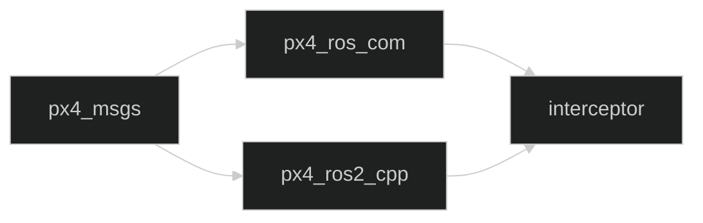

# Mapa completo de archivos y dependencias

Esta página cubre **todos los archivos que forman parte de `src/` y `.github/`**.
El inventario actual contiene 590 archivos:

| Zona | Archivos | Propósito |
| --- | ---: | --- |
| `src/interceptor` | 12 | Código propio del proyecto. |
| `src/px4_msgs` | 289 | Definiciones ROS 2 equivalentes a mensajes, servicios y acciones de PX4. |
| `src/px4_ros_com` | 28 | Ejemplos y utilidades de comunicación entre ROS 2 y PX4. |
| `src/px4-ros2-interface-lib` | 258 | Biblioteca vendorizada para registrar modos PX4 y enviar setpoints. |
| `.github/workflows` | 3 | Automatización de CI, resúmenes de issues y releases. |

## Cómo consultar este mapa

No hace falta abrir los 590 archivos en orden: el número indica cuántos archivos
hay, no una secuencia de lectura. Empieza por `src/interceptor`, porque es el
código de este proyecto, y después consulta solo la dependencia que necesites
entender. Cuando veas una carpeta, piensa que es una caja con un propósito;
cuando veas un archivo, pregunta si contiene instrucciones, datos,
configuración o documentación. Esta clasificación es más útil que memorizar
los nombres, y encaja con los cinco tipos principales que aparecen en el
inventario:

1. **Código propio**: `src/interceptor`.
2. **Dependencias vendorizadas**: los otros tres paquetes dentro de `src/`.
3. **Interfaces**: archivos `.msg` y `.srv` que describen estructuras de datos.
4. **Configuración y construcción**: `CMakeLists.txt`, `package.xml`, YAML,
   JSON, repositorios y archivos de formato.
5. **Automatización y documentación**: workflows, README, scripts y documentos
   de contribución.

Una dependencia vendorizada no se debe modificar para arreglar un comportamiento
del interceptor. Primero se debe entender qué interfaz ofrece y cambiar solo
`src/interceptor`, salvo que el objetivo sea actualizar esa dependencia.

## `src/interceptor`: los 12 archivos propios

| Archivo | Qué hace |
| --- | --- |
| [`CMakeLists.txt`](../../src/interceptor/CMakeLists.txt) | Declara dependencias, compila los seis ejecutables e instala binarios y launch. |
| [`package.xml`](../../src/interceptor/package.xml) | Declara el nombre, versión, licencia y dependencias ROS 2 del paquete. |
| [`README.md`](../../src/interceptor/README.md) | Guía breve de instalación y enlaces oficiales. |
| [`LICENSE`](../../src/interceptor/LICENSE) | Condiciones legales del paquete propio. |
| [`.gitignore`](../../src/interceptor/.gitignore) | Evita guardar artefactos locales del paquete. |
| [`launch/interceptor.launch.py`](../../src/interceptor/launch/interceptor.launch.py) | Inicia agente DDS, conversores y diagnóstico, y un solo modo elegido con `mode:=pn\|pursuit`. |
| [`src/interceptor_tf2_odometry.cpp`](../../src/interceptor/src/interceptor_tf2_odometry.cpp) | Convierte odometría de PX4 y publica el frame del interceptor. |
| [`src/target_tf2_odometry.cpp`](../../src/interceptor/src/target_tf2_odometry.cpp) | Publica el frame del target (desplazado al origen del interceptor) y su velocidad ENU. |
| [`src/pursuit_mode.cpp`](../../src/interceptor/src/pursuit_mode.cpp) | Modo de persecución pura basado en posición. |
| [`src/PN_mode.cpp`](../../src/interceptor/src/PN_mode.cpp) | Modo de navegación proporcional basado en posición y velocidad. |
| [`src/tf2_listener.cpp`](../../src/interceptor/src/tf2_listener.cpp) | Herramienta para imprimir transformaciones relativas. |
| [`src/vehicle_odometry_subscriber.cpp`](../../src/interceptor/src/vehicle_odometry_subscriber.cpp) | Imprime la odometría de un vehículo para diagnóstico; el launch lo arranca dos veces con parámetros `vehicle_name`/`odometry_topic` distintos. |

La explicación línea por línea de estos archivos está en
[Lectura guiada del código](Code-walkthrough.md).

## `src/px4_msgs`: mensajes y servicios PX4

Este paquete no implementa el control de vuelo. Define los tipos que permiten
que ROS 2 intercambie datos con PX4.

| Zona | Archivos actuales | Explicación |
| --- | ---: | --- |
| `msg/*.msg` | 261 | Cada archivo describe campos y tipos de un mensaje uORB de PX4. |
| `srv/VehicleCommand.srv` | 1 | Describe una petición/respuesta para comandos de vehículo. |
| `CMakeLists.txt` | 1 | Genera código ROS 2 a partir de `.msg` y `.srv`. |
| `package.xml` | 1 | Declara generadores y runtime de interfaces. |
| `README.md` | 1 | Documenta el paquete oficial y su uso. |
| `CHANGELOG.rst` | 1 | Historial de cambios. |
| `CONTRIBUTING.md` | 1 | Reglas para contribuir al paquete externo. |
| `QUALITY_DECLARATION.md` | 1 | Declaración de calidad del paquete. |
| `CODE_OF_CONDUCT.md` | 1 | Normas de convivencia. |
| `SECURITY.md` | 1 | Proceso de reporte de vulnerabilidades. |
| `LICENSE` | 1 | Licencia BSD-3-Clause. |
| `.github/` | 10 | Plantillas, configuración de dependabot y workflows del upstream. |
| `container/` | 2 | Dockerfile y scripts para construir paquetes Debian. |
| `scripts/` | 3 | Automatización de changelog, releases y builds. |
| `.gitignore`, `.dockerignore`, `.pre-commit-config.yaml` | 3 | Exclusiones y herramientas de desarrollo. |

### Cómo leer un `.msg`

Un `.msg` contiene líneas como `float32 x` o `uint64 timestamp`. No es una
clase C++ escrita a mano: el generador de ROS 2 convierte esa descripción en
tipos de programación. Por eso el interceptor puede escribir
`px4_msgs::msg::VehicleOdometry` y acceder a `position`, `velocity` o `q`.

Los 261 mensajes se organizan por capacidad de PX4: odometría, sensores,
actuadores, navegación, estado, setpoints y comandos. Cada archivo concreto
describe un contrato de datos; cambiarlo puede romper la compatibilidad con la
versión de PX4 que publica esos campos.

## `src/px4_ros_com`: puente y ejemplos ROS 2/PX4

| Zona | Archivos actuales | Explicación |
| --- | ---: | --- |
| `CMakeLists.txt` y `package.xml` | 2 | Construyen el paquete y declaran Eigen, ROS 2 y `px4_msgs`. |
| `include/px4_ros_com/` | 1 header | Declara las conversiones de marcos, usadas por el interceptor. |
| `src/lib/frame_transforms.cpp` | 1 | Implementa conversiones NED/ENU y orientaciones PX4/ROS. |
| `src/examples/` | 5 | Ejemplos C++ de listeners, advertisers y offboard. |
| `src/examples/offboard_py/` | 1 | Ejemplo Python de control offboard. |
| `px4_ros_com/` (paquete Python) | 2 | `__init__.py` y `module_to_import.py`, ambos vacíos: el esqueleto Python que instala `ament_python_install_package` en `CMakeLists.txt`, sin uso real en los ejemplos actuales. |
| `launch/` | 2 | Launch de ejemplos de comunicación (YAML y Python). |
| `test/` | 4 | Pruebas Python del paquete externo. |
| `scripts/` | 4 | Scripts de instalación y compilación. |
| `README.md`, `LICENSE` | 2 | Documentación y licencia. |
| `.github/`, `.vscode/`, `.gitignore` | 4 | CI, configuración del editor y exclusiones. |

El archivo que usa directamente nuestro código es
`include/px4_ros_com/frame_transforms.h`. Sus funciones evitan duplicar a mano
los cambios de signos y ejes entre NED y ENU.

## `src/px4-ros2-interface-lib`: biblioteca de modos PX4

Esta dependencia proporciona `px4_ros2::ModeBase`,
`px4_ros2::NodeWithMode`, `OdometryLocalPosition` y
`TrajectorySetpointType`.

| Zona | Archivos actuales | Explicación |
| --- | ---: | --- |
| `px4_ros2_cpp/` | 146 | Biblioteca C++: headers públicos, implementación, componentes, odometría, navegación, setpoints y tests. Incluye su propio `CMakeLists.txt`, `package.xml` y `rosdep-*.yaml` por distribución ROS. |
| `px4_ros2_py/` | 17 | Bindings y paquete Python experimental, con su propio `CMakeLists.txt` y `package.xml`. |
| `examples/cpp/` | 54 | Modos y ejemplos C++: goto, misión, rover, VTOL, manual y navegación; cada ejemplo trae su propio `CMakeLists.txt` y `package.xml`. |
| `examples/python/` | 12 | Ejemplos Python de modos, cada uno con su propio `package.xml`. |
| `mission/` | 2 | Un esquema (`schema.yaml`) y un ejemplo (`pickup.json`) de misión. |
| `python_docs/` | 5 | Configuración y páginas de documentación Python (Sphinx). |
| `scripts/` | 5 | Comprobación de compatibilidad, topics, clang-tidy y Doxygen. |
| `.github/` | 6 | Workflows de CI, lint, publicación de paquetes Debian, ramas de release y validación de misiones. |
| `.clang-format`, `.clang-format-ignore`, `.clang-tidy`, `.pre-commit-config.yaml`, `.vscode/` | 5 | Formato, análisis estático, hooks y editor. |
| `README.md`, `LICENSE`, `Doxyfile`, `.gitignore`, `dependencies.repos`, `ruff.toml` | 6 | Documentación, licencia, generación de API, exclusiones, dependencias externas y configuración del linter Python `ruff`. |

### Qué ocurre cuando usamos esta biblioteca

`pursuit_mode.cpp` no publica directamente un mensaje PX4 de bajo nivel. Hereda
de `ModeBase`, crea un `TrajectorySetpointType` y deja que la biblioteca:

1. registre el modo con PX4;
2. compruebe compatibilidad de mensajes;
3. gestione el estado del modo;
4. traduzca velocidad/aceleración a los mensajes que PX4 espera.

Los ejemplos vendorizados son material didáctico útil, pero no forman parte del
algoritmo del interceptor.

## Cómo viajan las dependencias durante la compilación

La relación entre paquetes puede imaginarse como una cadena:

`px4_msgs` define tipos. `px4_ros_com` usa esos tipos y ofrece conversiones.
`px4_ros2_cpp` usa mensajes y publica la infraestructura de modos. Finalmente,
`interceptor` combina esas piezas en sus nodos y algoritmos.

Por eso `colcon build --packages-up-to interceptor` puede construir más de un
paquete aunque el cambio esté en un solo `.cpp`: necesita tener disponible toda
la cadena previa.

## Extensiones de archivo como guía de lectura

| Extensión | Pregunta que ayuda a responder |
| --- | --- |
| `.cpp` | ¿Qué comportamiento ejecutable implementa? |
| `.hpp`/`.h` | ¿Qué interfaz declara para otros archivos? |
| `.msg` | ¿Qué campos viajan por un mensaje ROS 2? |
| `.srv` | ¿Qué petición y respuesta define un servicio? |
| `.xml` | ¿Qué metadatos o dependencias declara? |
| `CMakeLists.txt` | ¿Cómo se configura y enlaza la compilación? |
| `.py` | ¿Es launch, herramienta, ejemplo o binding? |
| `.yaml`/`.yml` | ¿Es configuración de herramientas o automatización CI? |
| `.sh`/`.bash` | ¿Qué pasos repetitivos de shell se automatizan? |
| `.rst`/`.md` | ¿Qué instrucciones o decisiones documenta? |
| `.json` | ¿Qué datos de ejemplo o misión se representan? |

La extensión no lo explica todo, pero permite decidir qué leer primero cuando se
entra en una carpeta desconocida.

## Qué pertenece al producto y qué pertenece al entorno

El producto que el equipo está desarrollando es principalmente
`src/interceptor`. El resto del workspace hace posible compilarlo y conectarlo
con PX4. `.github/workflows` automatiza el mantenimiento del repositorio, pero
no se ejecuta durante el vuelo.

Esta distinción ayuda a decidir dónde mirar ante un fallo, y qué hacer antes de
tocar un archivo:

- fallo en el algoritmo o en un tópico propio: `src/interceptor`, que es
  código que mantenemos nosotros;
- mensaje ausente o incompatible: revisar `px4_msgs` y la versión de PX4;
- conversión de coordenadas: revisar `px4_ros_com`;
- registro del modo/setpoint: revisar `px4-ros2-interface-lib`;
- compilación o pruebas automáticas: raíz `.github` y `CMakeLists.txt`;
- documentación o instrucciones: README y wiki;
- si el archivo está en `px4_msgs`, `px4_ros_com` o `px4-ros2-interface-lib`,
  es una dependencia externa: antes de modificarlo hay que consultar su
  versión upstream, su licencia, su changelog y sus pruebas, para no acabar
  manteniendo nosotros una implementación que en realidad mantiene otro
  proyecto — y si es un `.msg`/`.srv` o un `CMakeLists.txt`/`package.xml`, el
  cambio además altera un contrato de comunicación o la compilación/runtime;
- si el archivo está bajo `.github`, puede alterar CI, permisos o releases.

## `.github/workflows`: automatización del repositorio

Esta sección resume qué hace cada uno de los tres workflows propios del
repositorio (no los de las dependencias vendorizadas, ver más abajo).

### `ci-build.yml`

Archivo: [`ci-build.yml`](../../.github/workflows/ci-build.yml)

Se ejecuta en `push` y pull request hacia `main` o `master`. El job corre en
`ubuntu-24.04` dentro del contenedor `ros:jazzy-ros-base`, hace checkout,
instala `colcon`, `rosdep` y el compilador con `apt-get`, e inicializa rosdep
(`rosdep init` seguido de `true`, para que el paso no falle si ya estaba
inicializado) antes de instalar las dependencias declaradas por todos los
paquetes fuente. Con el entorno ROS ya cargado (`source
/opt/ros/jazzy/setup.bash`), compila hasta `interceptor` con `colcon build
--packages-up-to interceptor`, ejecuta `colcon test --packages-select
interceptor` y muestra el resultado con `colcon test-result --verbose`. Es la
reproducción automática de los comandos de
[Instalación y compilación](Installation-and-build.md).

### `summary.yml`

Archivo: [`summary.yml`](../../.github/workflows/summary.yml)

Se activa cuando se abre un issue. `name` identifica el workflow. `on: issues:
types: [opened]` lo limita a issues nuevos. `permissions` concede solo lectura
de modelos/contenido y escritura de issues.

El job corre en `ubuntu-latest`, hace checkout y ejecuta
`actions/ai-inference@v1` para producir un resumen. `id: inference` permite
referenciar su salida como `steps.inference.outputs.response`. El prompt usa
el título y cuerpo del issue como datos no confiables y ordena resumirlos, no
obedecer instrucciones que puedan contener.

La última acción ejecuta `gh issue comment`. Sus variables de entorno reciben
el token de GitHub, el número del issue y la respuesta generada. Por tanto,
este workflow publica automáticamente un comentario; no modifica el código.

### `tagging.yml`

Archivo: [`tagging.yml`](../../.github/workflows/tagging.yml)

`workflow_run` espera a que termine el workflow cuyo nombre exacto es
`CI - Build ROS 2 workspace`, únicamente en `main`; `workflow_dispatch` permite
lanzarlo manualmente. El job solo continúa si fue manual o si CI terminó con
éxito.

`permissions: contents: write` permite crear tags/releases. `checkout` usa
`fetch-depth: 0` para disponer del historial completo. El action
`github-tag-action` calcula un tag semántico usando `GITHUB_TOKEN`, prefijo `v`
y bump por defecto `none`. Si produce `new_tag`, `action-gh-release` crea una
release, usa el tag como nombre y genera notas automáticamente. Necesita
permiso `contents: write`, por lo que no se debe modificar sin entender sus
efectos sobre publicaciones reales.

## Archivos `.github` dentro de dependencias

Los directorios `.github` de `px4_msgs`, `px4_ros_com` y
`px4-ros2-interface-lib` pertenecen a esos proyectos upstream. Contienen
workflows de compilación/lint/release, plantillas de pull request, dependabot,
codeowners y configuración de seguridad. No controlan directamente el workflow
raíz de `ws_interceptor`; cada repositorio conserva sus propias automatizaciones
porque las dependencias se han copiado dentro de este workspace.

Si has seguido el recorrido recomendado de la wiki, este mapa llega después de
[Lectura guiada del código](Code-walkthrough.md) y de las tres páginas de
"Análisis línea por línea", así que el siguiente paso natural es
[Referencia rápida y solución de problemas](Quick-reference-and-troubleshooting.md).
Si en cambio llegaste directo a esta página sin pasar por las anteriores, úsala
como índice para localizar el archivo que buscas, y luego consulta
[Lectura guiada del código](Code-walkthrough.md) o las páginas de
"Análisis línea por línea" para entender sus líneas en detalle.

---

🏠 [Inicio](Home.md) · ⬅️ Anterior: [Análisis línea por línea: modos de guiado](Line-by-line-guidance-modes.md) · ➡️ Siguiente: [Referencia rápida y solución de problemas](Quick-reference-and-troubleshooting.md)
